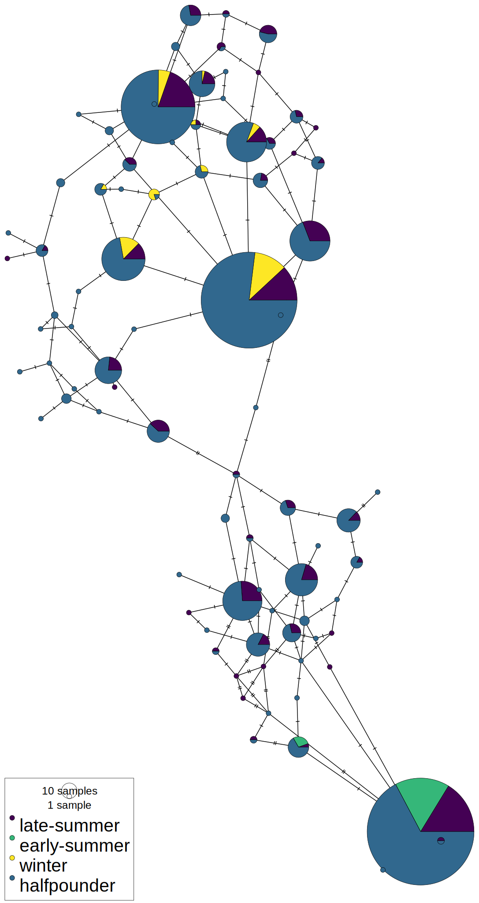
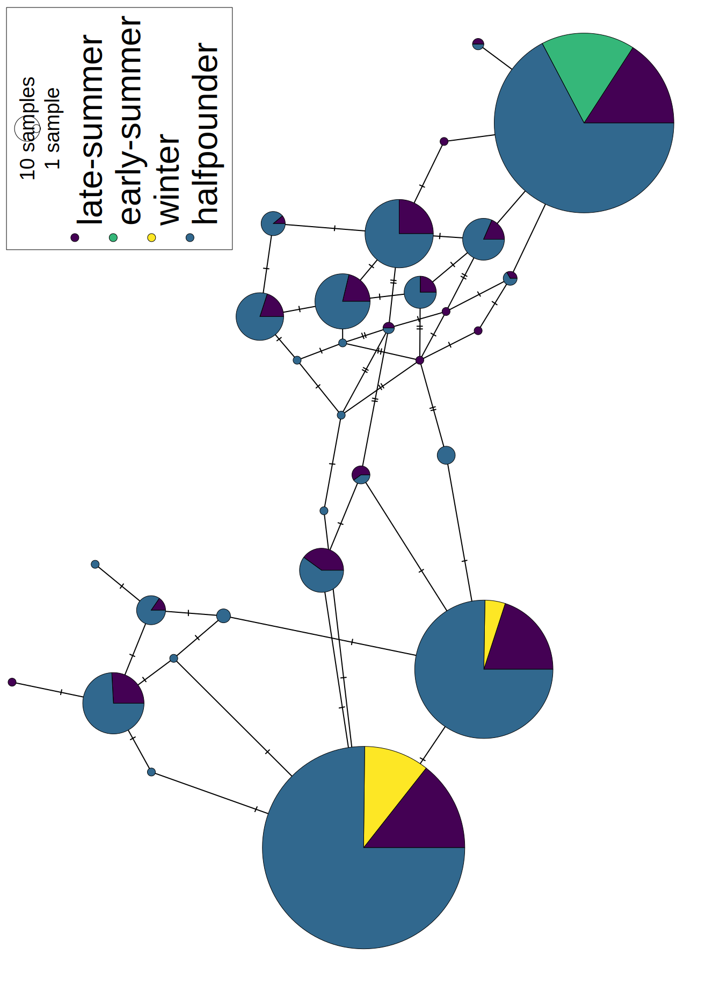

```{r, message=FALSE, warning=FALSE}
require(car)
require(plotly)
require(hierfstat)
require(adegenet)
require(PopGenReport)
require(pheatmap)
require(MASS)
require(tidyverse)
#require(DiagrammeR)
require(poppr)
require(genepop)
#require(graph4lg)
require(knitr)
require(pegas)
require(cowplot)
require(magrittr)
require(kableExtra)
require(khroma)

```

__Genetic diversity within late-summer run and half-pounder steelhead (Oncorhynchus mykiss) in the Rogue River, Oregon__  

_Conservation Genetics_


David I Dayan (1)*, Steve Mazur (3), Laura J Green (3), Andrew J Wells (3), Marc A Johnson (2), Daniel J Van Dyke (4), Peter A Samarin (4), Ryan D Battleson (4), Kathleen G O’Malley (1)   

(1) State Fisheries Genomics Laboratory, Coastal Oregon Marine Experiment Station, Department of Fisheries, Wildlife and Conservation Sciences, Hatfield Marine Science Center, Oregon State University, Newport, OR, USA  
(2) Native Fish Conservation and Recovery, Oregon Department of Fish and Wildlife, Salem, OR, USA  
(3) Oregon Department of Fish and Wildlife, Gold Beach, OR, USA  
(4) Rogue Watershed District, Oregon Department of Fish and Wildlife, Central Point, OR, USA  

\* Corresponding author, email: david.dayan@oregonstate.edu, ORCID ID: 0000-0001-5001-4062


# Readme

This is an rstudio project. If you'd like to pre-rendered figures, read a summary of analysis and view code, please open the html file in a browser. 


To conduct the analyses on your computer, edit or run code: clone this repository into a directory on you r local machine and open the .Rproj file in Rstudio. All data and analyses are available in the github repository at https://github.com/david-dayan/half_pounder_2023 and archived at zenodo __UPDATE THIS__ https://zenodo.org/badge/latestdoi/302479383


# Rationale 

Steelhead on the Rogue River demonstrate tremendous life-history diversity. Freshwater entry timing spans most months of the year and include a "late-summer" or "fall" run in addition winter and early-summer runs.

Also, some steelhead on the Rogue express a "half-pounder" life-history. Half-pounders exhibit a "false-spawning run" (although some precocious males may spawn) as juveniles during the summer months, then return to sea to continue the marine growth phase. There is great interest in half-pounders from a management perspective, because (i) half pounder abundance should integrate juvenile freshwater and early ocean conditions for steelhead regardless of whether they express the half pounder phenotype (ii) half pounder abundance is predictive of steelhead abundance in historical dam passage counts, and (iii) half-pounders are a unique fishery of great cultural and economic value. However, the relative proportion of winter vs early summer vs late-summer run life histories expressed by half pounders later in life is unknown. Furthermore there is limited genetic information about the three adult runs of steelhead on the Rogue, so improving our understanding of the relationships between these runs is key to our research objectives regarding half-pounders.

This study attempts to use information from a GTseq marker panel to examine genetic structure within and among migratory groups of Rogue River steelhead. We also attempt to classify half-pounders and late-summer run adults into run-timing groups on the basis of run-timing associated genetic markers.

# Data Summary

## Samples

__Half Pounders__  
Samples were collected during ODFW’s Lower Rogue Seining Project in 2018 and 2019. The Lower Rogue Seining Project estimates escapement for Coho salmon, late-summer run _O. mykiss_, half-pounder _O. mykiss_ and fall Chinook salmon by beach seining near Huntley Park at approximate river mile 8, three times weekly from July through October. Half-pounder _O. mykiss_ were identified as individuals with fork length 250 - 410mm and sampled in batches of up to 50 fish each day for 11 days from September 7th to October 1st 2018 totaling 384 individuals and 18 days from August 14th to September 25th 2019 totaling 331 individuals. Caudal fin clips were taken for DNA extraction, and placed in daily batch vials containing 95% ethanol. Note that due to batch collection of fin clips, that these numbers are inflated (some individuals have multiple tissue samples - identified later and filtered) 

All half-pounders are non-marked and assumed to be natural origin fish.

Also ~5% of samples represented twice in GTseq library as QAQC samples

__Adults__  
For brevity and easy code comprehension, throughout the notebook early-summer run steelhead are referred to as summer run and late-summer run steelhead are referred to as fall run or late-summer. Fall is revised to late-summer and summer to early-summer for publication figures and tables to reflect terminology used by managers.

We sampled, 50 winter and 45 early-run summer run fish. Adult summer steelhead were sampled at the Cole River Hatchery sorting pond on 6/26/2019 and (b) adult winter steelhead were sampled at Cole Rivers Hatchery (Rogue River) and the Applegate River from adult brood stock for 2019. 166 late-summer run fish (fall run) were sampled at the Huntley Park seine on the lower Rogue in 2019 and an additional 119 late-summer fish were collected at Huntley in 2020. Note that the fall run sample likely includes a broad range of freshwater entry timing, and incorporates individuals that may later migrate throughout the basin, whereas the winter and summer samples are a single sample in time and space and likely do not represent the full spatial or temporal migratory diversity of steelhead belonging to these runs.

All but 4 early-summer run adults are marked and assumed to hatchery origin fish. The final filtered dataset contained 1 natural origin and 41 hatchery origin fish. Winter run fish include NOR and HOR fish. After filtering the final dataset contains 18 HOR and 22 NOR fish. Early summer run fish are all unmarked and assumed NOR. All late-summer fish were unmarked and assumed NOR.

__Sample Size Summary__   
Sample size per group after genotype quality filtering are below. 

```{r Import Data}
load("./genotype_data_2021/genind_2.0.R")
load("./genotype_data_2021/genotypes_2.2.R")
genos_2.3 <- genos_2.2
genind_2.1 <- genind_2.0
genos_2.3 <- ungroup(genos_2.3)
kable(genos_2.3 %>%
  group_by(run, year) %>%
  tally(), caption = "Sample Sizes by Group and Year")

```

## Genotype Data

Information about sequencing data, genotype calling and filtering is available in the relevant R notebook (2021_genotyping_notebook.Rmd) in this repository. In this notebook we begin from the genotype quality filtered dataset. We then create two datasets:  

__Neutral, LD-thinned dataset__: 

After genotype quality filtering, retain only markers that are putatively neutral (i.e. remove any "adaptive" marker that is included in the panel because it is candidate from environmental associatiion analysis or genome-wide association analysis for ecologically relevant trait, we'll also exlude the sex marker and species id markers at this point), then LD thin.  

n_markers = 233  

__Migration Timing Associated Markers__:  

After genotype quality filtering, retain only markers that are associated with adult migration timing.  

n_markers = 12

# Data Prep

Here we import and finalize our datasets

```{r, eval = FALSE}
#save a file with this info
progeny <- readxl::read_xlsx("metadata/2019_summer/Omy Rogue2019 steelhead datasheets.xlsx", sheet = 4) 
progeny <- progeny %>%
  select(SFGL_ID, Origin)
select(genos_2.3, Sample, run, year, Date) %>%
  left_join(progeny, by = c("Sample" = "SFGL_ID")) %>%
  mutate(Origin = replace(Origin, Origin == "AD", "HOR")) %>%
  mutate(Origin = replace(Origin, Origin == "1", "NOR")) %>%
  replace_na(list(Origin = "NOR")) %>%
  write_tsv("supplemental_files_for_ms/sample_metadata_2021.txt")#convert AD (HOR) and 1 (NOR)


```


The table below demonstrates the marker names, annotations, and mapped positions to the GCA_002163495.1 rainbow trout genome for the genotype quality filtered dataset.

```{r marker info, message = FALSE, warning=FALSE}
# import marker info, we'll also use this object to summarise and filter our panel later
marker_mapping <- readxl::read_xlsx("./metadata/final_mapping_results.xlsx", sheet = 1)

marker_summary <- marker_mapping %>%
  mutate(marker = str_replace(marker, "Omy(\\d+)", "Chr\\1")) %>% # convert names to match
  filter(marker %in% colnames(genos_2.3)) %>% # exclude filtered loci
  mutate(neutral = if_else(str_detect(`Presumed Type`, 'neutral|Neutral'), "neutral", "adaptive")) %>%
  mutate(run_timing = if_else(str_detect(`Presumed Type`, 'run|Run'), "run_timing", "non-run_timing")) %>%
  dplyr::select(marker, chr, start, 'Presumed Type', neutral, run_timing, Source)

DT::datatable(marker_summary, options = list(pageLength=10))

```

## Neutral, LD-thinned dataset

Now let's get just the neutral markers.

```{r}
neutral_markers <- marker_summary %>%
  filter(neutral == "neutral") %>%
  mutate(marker = str_replace(marker, "\\.", "_")) %>%# extra name change step (adegenet converts . to _)
  pull(marker)

genind_neutral <- genind_2.1[loc = neutral_markers]
```

Of the 350 markers that passed genotype quality filtering, there were 237 neutral markers.

__LD Thin__  
Let's LD-thin these 237 neutral markers.

We don't want to make any strong assumptions about population substructure before LD filtering, so let's split into our four sample groups and calculate LD for each. Then we'll look at the distribution of LD across groups to make sure there are no group specific patterns, then combine the data and choose an appropriate cutoff for filtering. This way we won't mistake population structure for LD. 

```{r LD-Thin Dataset, cache=TRUE, message=FALSE, warning=FALSE, results = "hide"}
# first lets calculate LD (dartR has a great (fast) r2 calculator that works right on genind files, so let's use this)
n.pop <- seppop(genind_neutral)

#fall
ldreport_fall <- dartR::gl.report.ld(dartR::gi2gl(n.pop$fall, verbose = 0), name = NULL, save = FALSE, nchunks = 2, ncores = 3, chunkname = NULL, verbose = 0)

#half
ldreport_half <- dartR::gl.report.ld(dartR::gi2gl(n.pop$halfpounder, verbose = 0), name = NULL, save = FALSE, nchunks = 2, ncores = 3, chunkname = NULL, verbose = 0)

#half
ldreport_summer <- dartR::gl.report.ld(dartR::gi2gl(n.pop$Summer, verbose = 0), name = NULL, save = FALSE, nchunks = 2, ncores = 3, chunkname = NULL, verbose = 0)

#winter
ldreport_winter <- dartR::gl.report.ld(dartR::gi2gl(n.pop$Winter, verbose = 0), name = NULL, save = FALSE, nchunks = 2, ncores = 3, chunkname = NULL, verbose = 0)

```

```{r, warning = FALSE, message=FALSE}
# now let's combine these LD reports into a single dataframe 
ld_report <- bind_rows(ldreport_fall, ldreport_half, ldreport_summer, ldreport_winter, .id = "pop")

# we have pretty decent mapping information for our markers, let's only look at physical LD (exclude comparisons across chromosomes or contigs)

# ld report calls markers by order (not name) so let's get names together in order from the genind object first
marker_summary_2 <- data.frame(marker = names(genind_neutral$loc.n.all))

marker_summary_2 %<>%
  left_join(select(mutate(marker_summary, marker = str_replace(marker, "\\.", "_")), marker, chr, start) ) %>%
  rowid_to_column(var = "rowid")

# get marker info on the ld report
ld_report %<>%
  mutate(pop = case_when(pop == "1" ~ "fall",
                         pop == "2" ~ "half",
                         pop == "3" ~ "summer",
                         pop == "4" ~ "winter")) %>%
  left_join(marker_summary_2, by = c("loc1" = "rowid")) %>% 
  rename(marker_1 = marker, chr_1 = chr, start1 = start) %>% 
  left_join(marker_summary_2, by = c("loc2" = "rowid")) %>% 
  rename(marker_2 = marker, chr_2 = chr, start2 = start) 
  
# ignore LD across chromosomes
ld_report %<>%
  filter(chr_1 == chr_2)
```

Okay let's look at LD across groups. The expectation here is that LD should be more extensive in the winter and summer groups than the fall and halfpounder because the latter two were collected low in the river and contain more spatial and temporal structure. 
```{r, message=FALSE, warning=FALSE}
ggplot(ld_report)+geom_density(aes(R2, color = pop, fill = pop), alpha = 0.5)+scale_color_viridis_d()+theme_classic()+scale_fill_viridis_d()

ggplot(ld_report)+geom_density(aes(R2, color = pop, fill = pop), alpha = 0.5)+scale_color_viridis_d()+theme_classic()+scale_fill_viridis_d()+xlim(0, 0.25)

#ld_report_wide <- ld_report %>%
#  pivot_wider(names_from = pop, values_from = R2)
#ggplot(ld_report)+geom_density(aes(R2, color = pop, fill = pop), alpha = 0.5)+scale_color_viridis_d()+theme_classic()+scale_fill_viridis_d()+xlim(0, 0.25)
#ld_report %<>%
 # mutate(dist = abs(as.numeric(start1) - as.numeric(start2)))

#let's plot ld decay
# if we want to get serious here we should go back and use the hill and weir formula to fit the decay, but we can just use loess smoothing for a quick look given that it's not critical to our analysis. 

#ggplot(filter(ld_report, dist < 250000))+geom_point(aes(dist, R2, color = pop), alpha = 0.5)+geom_smooth(aes(dist, R2, color = pop))+scale_color_viridis_d()+theme_classic()
```

```{r, eval = FALSE}
# How many of these LD outliers are shared? 
ld_report %>%
  filter(R2>0.025) %>%
  group_by(loc1, loc2) %>%
  tally() %>%
  filter(n > 3)
```

Sure enough. LD is more extensive in winter and summer, but it's not too different between groups background LD is around 0.025 in all groups, and there are a handful of marker pairs that are consistently in LD in all groups (analysis not shown, but see code chunk above). Let's combine the dataset and apply a universal threshold. 

```{r, message = FALSE, warning=FALSE, results='hide'}
ldreport <- dartR::gl.report.ld(dartR::gi2gl(genind_neutral, verbose = 0), name = NULL, save = FALSE, nchunks = 2, ncores = 3, chunkname = NULL, verbose = 0)
ggplot(ld_report)+geom_density(aes(R2))+theme_classic()
```

Very few markers show even modest LD (greater than 0.2). We'll prune (keep one) the dataset of any locus-pairs with r2 > 0.2.
```{r LD-Thin 2}
genind_neutral <- genind_neutral[loc=-unique(ldreport[ldreport$R2>0.2,]$loc2)]
```

Let's also get the dataframe version of the dataset as an object in the environment.
```{r, cache = TRUE, message = FALSE, warning=FALSE}
neutral_markers_ldfiltered <- names(genind_neutral$loc.n.all)
genos_2.3 %<>%
  rename_all(funs(str_replace_all(., '\\.', '_'))) %>%
  select(Sample:IFI, Date, run, year, OmyY1_2SEXY, all_of(neutral_markers_ldfiltered))
```

## Migration Timing Dataset

There are 12 migration timing associated markers in the genotype quality filtered dataset. Let's get them.

```{r}
migration_timing_markers <- marker_summary %>%
  filter(run_timing == "run_timing") %>%
  pull(marker)

genos_run <- genos_2.2 %>%
  select(Sample:IFI, Date, run, year, OmyY1_2SEXY, all_of(migration_timing_markers))

genind_run <- genind_2.1[loc = migration_timing_markers]
```

```{r}
#great now let's clean up the environment
rm(n.pop, ld_report, ldreport_fall, ldreport_half, ldreport_summer, ldreport_winter, marker_summary_2)
```

# Diversity Metrics

Here we calculate both per-marker and per-run diversity metrics (Ho He HWE Fis and Fst)

## Heterozygosity

### Heterogyzity metrics

First we plot observed and expected heterozygosity, and get a table for the manuscript.

__Neutral Markers__
```{r He, message=FALSE, warning=FALSE}
# first Ho and He
n.pop <- seppop(genind_neutral)

hobs <- lapply(n.pop, function(x) (summary(x)$Hobs))
hobs <- as.data.frame(t(do.call(rbind, hobs)))
hobs <- hobs %>%
  rownames_to_column(var="marker")
hobs <- hobs %>%
  pivot_longer(-marker, names_to = "run", values_to = "Ho")
#ggplot(hobs)+geom_boxplot(aes(x=pop, y=hobs))+theme_classic()+xlab("Run Timing")+ylab("Observed Heterozygosity")

hexp <- lapply(n.pop, function(x) (summary(x)$Hexp))
hexp <- as.data.frame(t(do.call(rbind, hexp)))
hexp <- hexp %>%
  rownames_to_column(var="marker") %>%
  pivot_longer(-marker, names_to = "run", values_to = "He")

marker_divs <- hexp %>%
  left_join(hobs)


# lets convert to longer format
marker_divs <-  marker_divs %>%
   pivot_longer(c("Ho", "He"), names_to = "obs_exp", values_to ="H")


# lets throw up some nice plots here for all markers
ggplot(data=marker_divs)+geom_boxplot(aes(x=run, y=H, fill = obs_exp))+scale_fill_viridis_d()+theme_classic()


#ggplot(data=marker_divs[marker_divs$run_timing_marker=="run",])+geom_boxplot(aes(x=run, y=H, fill = obs_exp))+scale_fill_viridis_d()+theme_classic()+ggtitle("run-timing markers")

#publication plot fig. 1
#ggplot(data=drop_na(marker_divs[marker_divs$run_timing_marker=="run",]))+geom_boxplot(aes(x=run, y=H, fill = obs_exp), alpha = 0.8)+scale_fill_viridis_d(labels = c(expression(H[E]), expression(H[O])), name = " ")+theme_classic()+xlab("")+scale_x_discrete(labels = c("Late-Summer", "Half-Pounder", "Early-Summer", "Winter"))+theme(axis.text.x = element_text(size = 10, angle = 90))

# publication plot suppl fig. 1
# a <- ggplot(data=drop_na(marker_divs[marker_divs$neutral=="neutral",]))+geom_boxplot(aes(x=run, y=H, fill = obs_exp), alpha = 0.8)+scale_fill_viridis_d(labels = c(expression(H[E]), expression(H[O])), name = " ")+theme_classic()+xlab("")+scale_x_discrete(labels = c("Late-Summer", "Half-Pounder", "Early-Summer", "Winter"))+theme(legend.position = "none")+theme(axis.text.x = element_text(size = 10, angle = 90))
# 
# b <- ggplot(data=drop_na(marker_divs[marker_divs$neutral=="adaptive",]))+geom_boxplot(aes(x=run, y=H, fill = obs_exp), alpha = 0.8)+scale_fill_viridis_d(labels = c(expression(H[E]), expression(H[O])), name = " ")+theme_classic()+xlab("")+scale_x_discrete(labels = c("Late-Summer", "Half-Pounder", "Early-Summer", "Winter"))+ylim(0,0.68)+theme(axis.text.x = element_text(size = 10, angle = 90))
# 
# plot_grid(a,b, rel_widths = c(0.83,1), labels = c("(a)", "(b)"))

#supplemental table
kable(marker_divs %>%
  group_by(run, obs_exp) %>%
  summarise(mean = mean(H)), caption = "Mean observed and expected heterozygosity at nuetral markers")


```
$~$  
There are no big differences in diversity in between runs, and there is a slight dearth of heterozygotes in all groups indicating potential structure. 

Are there significant departures from HWE at the loci level?

```{r, cache=TRUE,warning=FALSE, message=FALSE}
# here we use the hw.test function from pegas (exact test based on Monte Carlo permutations of alleles, 1000 permutations)
HWE.test <- lapply(n.pop, function(x) hw.test(x, B=1000))

```

```{r , warning=FALSE, message=FALSE}
# here we take the list of dataframes of p-values and combine into a single dataframe
hwe <- reduce(HWE.test, cbind)
hwe <- hwe[,c(4,8,12,16)]
colnames(hwe) <- c("fall", "halfpounder", "summer", "winter")
hwe <- as.data.frame(hwe)

# next we correct for multiple comparisons
p.adj <- as.data.frame(apply(hwe, MARGIN = 2, function(x) p.adjust(x, "fdr")))
hwe_exceed <- p.adj %>% rownames_to_column(var="marker") %>%
  pivot_longer(-marker, names_to = "run", values_to = "fdr") %>%
  filter(fdr < 0.05)

hwe_exceed <- hwe_exceed %>%
  left_join(pivot_wider(marker_divs, names_from = obs_exp, values_from = H)) %>%  
  mutate(direction = if_else(He > Ho, "excess_homo", "excess_hetero")) %>%
  filter(direction == "excess_homo")

a <- hwe_exceed%>%
  group_by(run) %>%
  tally()

kable(a, caption = "Number of neutral markers significantly out of HWE")

```
$~$  
Yes, 7 in fall and 18 in halfpounderstable outside of HWE (fdr < 0.05) per "population." Note that the value above may differ from the publication numbers because this notebook rendering was not the one used for final results (e.g. other runs of the monte-carlo simulations may produce slightly different results).

__Migration Timing__    
What about migration timing markers? 

```{r He2, message=FALSE, warning=FALSE}
# first Ho and He
n.pop_run <- seppop(genind_run)

hobs <- lapply(n.pop_run, function(x) (summary(x)$Hobs))
hobs <- as.data.frame(t(do.call(rbind, hobs)))
hobs <- hobs %>%
  rownames_to_column(var="marker")
hobs <- hobs %>%
  pivot_longer(-marker, names_to = "run", values_to = "Ho")
#ggplot(hobs)+geom_boxplot(aes(x=pop, y=hobs))+theme_classic()+xlab("Run Timing")+ylab("Observed Heterozygosity")

hexp <- lapply(n.pop_run, function(x) (summary(x)$Hexp))
hexp <- as.data.frame(t(do.call(rbind, hexp)))
hexp <- hexp %>%
  rownames_to_column(var="marker") %>%
  pivot_longer(-marker, names_to = "run", values_to = "He")

marker_divs <- hexp %>%
  left_join(hobs)


# lets convert to longer format
marker_divs <-  marker_divs %>%
   pivot_longer(c("Ho", "He"), names_to = "obs_exp", values_to ="H")


# lets throw up some nice plots here for run markers
ggplot(data=marker_divs)+geom_boxplot(aes(x=run, y=H, fill = obs_exp))+scale_fill_viridis_d()+theme_classic()


#ggplot(data=marker_divs[marker_divs$run_timing_marker=="run",])+geom_boxplot(aes(x=run, y=H, fill = obs_exp))+scale_fill_viridis_d()+theme_classic()+ggtitle("run-timing markers")

#publication plot fig. 1
#ggplot(data=drop_na(marker_divs[marker_divs$run_timing_marker=="run",]))+geom_boxplot(aes(x=run, y=H, fill = obs_exp), alpha = 0.8)+scale_fill_viridis_d(labels = c(expression(H[E]), expression(H[O])), name = " ")+theme_classic()+xlab("")+scale_x_discrete(labels = c("Late-Summer", "Half-Pounder", "Early-Summer", "Winter"))+theme(axis.text.x = element_text(size = 10, angle = 90))

# publication plot suppl fig. 1
# a <- ggplot(data=drop_na(marker_divs[marker_divs$neutral=="neutral",]))+geom_boxplot(aes(x=run, y=H, fill = obs_exp), alpha = 0.8)+scale_fill_viridis_d(labels = c(expression(H[E]), expression(H[O])), name = " ")+theme_classic()+xlab("")+scale_x_discrete(labels = c("Late-Summer", "Half-Pounder", "Early-Summer", "Winter"))+theme(legend.position = "none")+theme(axis.text.x = element_text(size = 10, angle = 90))
# 
# b <- ggplot(data=drop_na(marker_divs[marker_divs$neutral=="adaptive",]))+geom_boxplot(aes(x=run, y=H, fill = obs_exp), alpha = 0.8)+scale_fill_viridis_d(labels = c(expression(H[E]), expression(H[O])), name = " ")+theme_classic()+xlab("")+scale_x_discrete(labels = c("Late-Summer", "Half-Pounder", "Early-Summer", "Winter"))+ylim(0,0.68)+theme(axis.text.x = element_text(size = 10, angle = 90))
# 
# plot_grid(a,b, rel_widths = c(0.83,1), labels = c("(a)", "(b)"))

#supplemental table
kable(marker_divs %>%
  group_by(run, obs_exp) %>%
  summarise(mean = mean(H)), caption = "Mean observed and expected heterozygosity at migration timing markers")


```
$~$  
Very little diversity at migration timing markers in summer and winter, but high diversity in halfpounders and fall. Importantly, the fall migration timing markers are in HWE, but the halfpounders are not! 

Is this significant? Let's do some locus level testing.

```{r, cache=TRUE,warning=FALSE, message=FALSE}
# here we use the hw.test function from pegas (exact test based on Monte Carlo permutations of alleles, 1000 permutations)
HWE.test <- lapply(n.pop_run, function(x) hw.test(x, B=1000))

```

```{r , warning=FALSE, message=FALSE}
# here we take the list of dataframes of p-values and combine into a single dataframe
hwe <- reduce(HWE.test, cbind)
hwe <- hwe[,c(4,8,12,16)]
colnames(hwe) <- c("fall", "halfpounder", "summer", "winter")
hwe <- as.data.frame(hwe)

# next we correct for multiple comparisons
p.adj <- as.data.frame(apply(hwe, MARGIN = 2, function(x) p.adjust(x, "fdr")))
hwe_exceed <- p.adj %>% rownames_to_column(var="marker") %>%
  pivot_longer(-marker, names_to = "run", values_to = "fdr") %>%
  filter(fdr < 0.05)

hwe_exceed <- hwe_exceed %>%
  left_join(pivot_wider(marker_divs, names_from = obs_exp, values_from = H)) %>%  
  mutate(direction = if_else(He > Ho, "excess_homo", "excess_hetero")) %>%
  filter(direction == "excess_homo")

a <- hwe_exceed%>%
  group_by(run) %>%
  tally()

kable(a, caption = "Number of migration timing markers significantly out of HWE")

```
$~$  
Yes, no migration timing markers are out of HWE in the adult groups, but 9 of 12 are out of HWE in the halfpounders. This already suggests Wahlund effects for the halfpounders, but not the fall, with respect to migration timing. Or put another way, halfpounders come from parents that include both early- and late- migration timing homozygote pairs, but fall run adults are produced by ongoing gene flow between early and late migrators.

## Fst

Let's move on to f-statistics. We'll use hierfstats for most of this work, so the first step is to convert to a hierfstat format. Then we'll calculate some basic statists and Fst (Nei).

```{r, warning=FALSE, message=FALSE}
fstat <- genind2hierfstat(genind_neutral)
colnames(fstat) <- c(pop, names(genind_neutral$loc.n.all))
# and also lets make datasets at different sets of loci, because hierfstat doesn't easily retain loci names for later use

fstat_run_timing <- genind2hierfstat(genind_run)
colnames(fstat_run_timing) <- c(pop, names(genind_run$loc.n.all))

#calculate datset wide basic stats
basicstats <- basic.stats(fstat)
basicstats_run_timing <- basic.stats(fstat_run_timing)

kable(basicstats$overall, caption = "Neutral Dataset Fstats")
kable(basicstats_run_timing$overall, caption = "Run Timing Marker Fstats")


```

### Pairwise Population Fst

Let's collect genetic distance info on pairs of pops as well (Weir and Cochran 1984). 

First, the neutral dataset:
```{r, cache = TRUE, warning = FALSE, message = FALSE}
genet.dist(fstat, method="WC84")
```
  
  
Then run timing dataset:
```{r, cache = TRUE, warning = FALSE, message = FALSE}
genet.dist(fstat_run_timing, method="WC84")
```

Same pattern at neutral and run timing markers, although at differentiation is obviously at a very different scale. Let's take a closer look. We'll plot the two against each other and conduct a Mantel test to get an idea of the strength of correlation between these two distance matrices

```{r, cache = TRUE, message = FALSE, warning=FALSE}
rt_fst <- genet.dist(fstat_run_timing, method="WC84")
rt_fst <- as.matrix(rt_fst)

fsts_rt <- t(combn(colnames(rt_fst ), 2))
a <- data.frame(fsts_rt, dist=rt_fst[fsts_rt])
a %<>%
  rename(fst_runtiming = dist)

n_fst <- genet.dist(fstat, method="WC84")
n_fst <- as.matrix(n_fst)

fsts_n <- t(combn(colnames(n_fst ), 2))
b <- data.frame(fsts_n, dist=n_fst[fsts_n])
b %<>%
  rename(fst_neutral = dist)

a %<>%
  left_join(b)

ggplot(a)+geom_point(aes(fst_runtiming,fst_neutral))+geom_smooth(aes(fst_runtiming,fst_neutral), method = "lm")+theme_bw()+xlab("Pairwise Fst at Migration Timing Markers")+ylab("Pairwise FST at Neutral Markers")

#cor(a$fst_runtiming,a$fst_neutral)

#oops forgot that the these are distance matrices, just use a mantel test!
mantel.randtest(genet.dist(fstat, method="WC84"), genet.dist(fstat_run_timing, method="WC84"))
```
  
Yes it appears that the very small amount of differentiation at neutral markers is correlated with the substantial differentiation at migration timing markers (Mantel test 0.85, p-value - 0.04)


We should also investigate if it is justified to group samples drawn from different years together like we have been doing. Let's split the year classes and run again

First for neutral dataset:  
```{r, cache = TRUE, warning = FALSE, message = FALSE}
genind_year <- genind_neutral

genind_year@pop <- as.factor(paste(genos_2.3$run, genos_2.3$year, sep = "_"))

fstat_year <- genind2hierfstat(genind_year)
colnames(fstat_year) <- c(pop, names(genind_year$loc.n.all))

genet.dist(fstat_year, method="WC84")

```
  
Then for the run timing f dataset:  
```{r, cache = TRUE, warning = FALSE, message = FALSE}
genind_year <- genind_run

genind_year@pop <- as.factor(paste(genos_2.3$run, genos_2.3$year, sep = "_"))

fstat_year <- genind2hierfstat(genind_year)
colnames(fstat_year) <- c(pop, names(genind_year$loc.n.all))

genet.dist(fstat_year, method="WC84")

```
  
Fst within runs across years is vanishingly small compared to most pairwise comparisons, let's continue to group them together for clarity.

### Fst Results Summary


Note that there are a couple assumptions/issues with this analysis and we would benefit from remembering these when considering the results summary below:  

(1) Limited sampling within summer and winter runs means we are undersampling diversity WITHIN these runs, and as a consequence potentially overstating the extent of differentiation BETWEEN runs.  
(2) While it is not our intention, estimating Fst among phenotypic groups implies that they are distinct genetic lineages. Instead, these Fst estimates represent the degree of genetic differentiation between a priori phenotypic groups.  

Very low differentiation overall (datasetwide FST = 0.0047). However there were some patterns.

(a) There is essentially zero differentiation between halfpounders and fall at both neutral and run timing markers.   
(b) Pairwise FST at neutral and run timing markers is strongly correlated suggesting that run timing is responsible for the neutral differentiation that we see between runs.  
(c) The greatest differentiation is between summer and winter. Fall/halfpounders are more similar to winter than summer (differentiation between halfpounder/fall vs summer about 2fold greater than halfpounder/fall vs winter), but there is still some differentiation keeping them apart from either group.  

# Population Structure

From the Fst estimation in the section above we have our first ideas about population structure: (a) fall run and half pounder fish demonstrate little to no differentiation from one another, and this group is less differentiated from winter run than summer run fish and (b) some evidence of structure WITHIN halfpounder and fall runs, but likely very little. In this section we will conduct several analyses to uncover population structure in greater detail.  


## PCA

```{r, message=FALSE, warning=FALSE}
#replace missing data using mean allele frequency
genind_scale <- scaleGen(genind_neutral, NA.method="mean")


# run the PCA, dudi.pca uses an interactive prompt to choose pcs to retain, we retain all in order to run some analyses on eigenvalues
pca1 <- dudi.pca(genind_scale,cent=FALSE,scale=FALSE, scannf = FALSE, nf = 353) # set nf greater than possible to retain all
#barplot(pca1$eig[1:353],main="PCA eigenvalues")
#s.class(pca1$li, pop(genind_2.3),xax=1,yax=2, col=transp(viridisLite::viridis(4),0.7), axesell=FALSE, cstar=0, cpoint=1, grid=FALSE)
#add.scatter.eig(pca1$eig[1:10],nf=3,xax=1,yax=2)


#publication quality figure
pca_vals <- pca1$li[,c(1:2)]
pca_vals <- pca_vals %>%
  rownames_to_column(var = "Sample") %>%
  left_join(select(genos_2.3, Sample, run)) %>%
  mutate(run = if_else(run == "fall", "Late-Summer", run)) %>%
  mutate(run = if_else(run == "halfpounder", "Half-Pounder", run)) %>%
  mutate(run = if_else(run == "Summer", "Early-Summer", run)) %>%
  mutate(run = fct_relevel(run, "Late-Summer", "Half-Pounder", "Early-Summer", "Winter"))
  

a <- ggplot(data = pca_vals, aes(Axis1, Axis2, color = run))+geom_point(alpha = 0.5)+stat_ellipse()+theme_classic()+scale_color_viridis_d(name = "")+xlab("Principal Component 1\n1.4% of Variation")+ylab("Principal Component 2\n1.0% of Variation")

eig <- as.data.frame(bind_cols(pca1$eig[1:20], seq(1,20)))
colnames(eig) <- c("eigenvalue", "pca")
b <- ggplot(data = eig)+geom_bar(aes(pca, eigenvalue), stat = "identity")+theme_classic()+xlab("")+ylab("")+theme(axis.text.x = element_blank())

plot_grid(a, b, ncol = 1, rel_heights = c(3,1), labels = "auto")


# publication figure
#ggplot(data = pca_vals, aes(Axis1, Axis2, color = run))+geom_point(alpha = 0.6)+stat_ellipse()+theme_classic()+scale_color_viridis_d(name = "")+xlab("Principal Component 1\n1.4% of Variation")+ylab("Principal Component 2\n1.0% of Variation")+theme(axis.title = element_text(size = 8), legend.text = element_text(size = 8))
```


```{r, message=FALSE, warning=FALSE}
plot_ly(x=pca1$li$Axis1, y=pca1$li$Axis2, z=pca1$li$Axis3, type="scatter3d", mode="markers", color=genos_2.3$run, alpha = 0.8)
```

Not terribly interesting 3rd axis, primarily captures differences between a few outlier individuals. We can expect this pattern to continue as we proceed down less informative eigenvectors, but let's demonstrate this using kaiser-guttman or broken stick.

```{r}
#kaiser guttman
cutoff<-mean(pca1$eig)
kg <- length((pca1$eig)[(pca1$eig)>cutoff])
barplot(pca1$eig, main = "PCA eigenvalues\nKaiser-Guttman Criteria (red line)")
abline(h = cutoff, col = "red")

#broken stick
n <- length(pca1$eig)
bsm <- data.frame(j=seq(1:n), p = 0)
bsm$p[1] <- 1/n
for (i in 2:n){
  bsm$p[i] <- bsm$p[i-1]+(1/(n+1-i))

}
bsm$p <- 100*bsm$p/n

pca_eigs_to_plot <- as.data.frame(cbind(100*pca1$eig/sum(pca1$eig)), rev(bsm$p))
pca_eigs_to_plot %<>%
  rownames_to_column(var = "bsm") %>%
  rename(pca_eig_perc = V1) %>%
  mutate(pca_eig_perc = as.numeric(pca_eig_perc))

pca_eigs_to_plot %<>%
  rowid_to_column("row_n") %>%
  mutate(bsm = as.numeric(bsm)) %>%
  pivot_longer(!row_n, names_to = "bsm_or_eig", values_to = "percent_variance")

ggplot(data = pca_eigs_to_plot[1:71,])+geom_bar(aes(x = as.factor(row_n), y = percent_variance, color = bsm_or_eig, fill = bsm_or_eig), stat = "identity", position=position_dodge())+theme_classic()+xlab("Eigenvector")+ylab("percent of variance")+ggtitle("Broken Stick Model")
```

Kaiser-Guttman is generally considered liberal, while broken stick is more conservative. We can see that pretty clearly playing out here, where KG selects suggests PC well into the portion of the screeplot where each successive PC explains only a tiny portion of variance less than the former, and Broken Stick suggests no PCs. Examining the screeplot ourselves we can see that there is a major break after the first PC. This suggests we should pay the most attention to the first PC, and subsequent PCs are not likely to be important. 

__PCA Summary__  
The first axis of genetic variation in the neutral dataset primarily captures variation within late-summer and half-pounders that is not observed within winter and summer runs. One interpretation of this result is that there is limited spatial sampling of winter and summer runs compared to fall and halfpounders and we could be observing genetic variation associated with sub-basin level structure not observed within the other samples. 

There are no distinct clusters in the data.  

## STRUCTURE

Here we use a bayesian, model based clustering algorithm (STRUCTURE) to infer population structure and estimate admixture proportions of individual samples.

First we need to get our dataset ready for structure.

```{r, eval=FALSE}

#note just sort of crashed through this with a text editor, not easily logged, but the general idea was transpose the data, split columns (diploid to dual haploid) then convert data to integers
df <- genind2df(genind_neutral)
df <- as.data.frame(t(df))
write_tsv(df, "genotype_data_2021/all.str.tmp")
#do regex here
df <- read_tsv("genotype_data_2021/all.str.tmp", col_names = FALSE)
df <- t(df)
write_tsv(as.data.frame(df), "genotype_data_2021/all.str", col_names = FALSE)

```


### Run Log  

Structure was run in a GUI outside this computation notebook's environment.   
__admixture model:__ admixture, with correlated allele frequency  
__burnin/mcmc:__ ran with k=1-5 for 100k iteration to check for convergence of alpha, strong convergence after a few hundred burn-in iterations, used 10,000/20,000 for final runs   
__replicates:__ did 10 replicates for k=1-5 

Best K was not chosen, but best k according to the evanno method was estimated in structure harvester for inclusing in the manuscript in case anyone wanted to see it.    
Replicate results within each K were clumpp'd using the clumpak algorithm on the clumpak webserver  

### Results

Here we visualize the structure results of the clumpp'd results of all K values

__Best K__


Best K was 2 according to the Evanno (delta K) method, however, it's important to remember the bias toward k=2 when differentiation is low or there is no population structure using this method. Delta k literally cannot evaluate K=1. In any case it seems like a good place to remind ourselves that k is a model that doesn't always fully catpure biological reality and comparing results across different levels of k can provide interesting insights, even when best k is unknown, particularly in the case of low differentiation.

note: patterns get pretty noisy at k = 5, we will restrict plotting to k = 2 - 4 for the ms


__Structure Plots__

Next let's take the clumppd results and make some publication-ready figures. First plot is downsampled to 42 samples per "population", second plot is full dataset.

As with other sampling procedures, the run presented in the final rendered notebook here may not be the run used in the publication (i.e. a different set of 42 samples may be presented here)

```{r,message=FALSE,warning=FALSE}
#import clump results into dataframes
# results are in files k*/majorcluster/clumppfiles/clumpindoutput
# took these files and captured the relevant data with a text editor (original input files are a mess with multiple field separators) and saved to new files
k2 <- read_tsv("structure/clumpak/formatted_results/k2.txt")
k3 <- read_tsv("structure/clumpak/formatted_results/k3.txt")
k4 <- read_tsv("structure/clumpak/formatted_results/k4.txt")
k5 <- read_tsv("structure/clumpak/formatted_results/k5.txt")

# downsample the half_pounder and fall fish to smaller size for plot
sampled_ind_40 <- k2 %>%
  rownames_to_column(var="id") %>% 
  group_by(pop) %>%
  sample_n(40) %>% 
  pull(id)

plot_data <- k2 %>% 
  rownames_to_column(var="id") %>% 
  filter(id %in% sampled_ind_40) %>%# sample the half_pounder and fall fish to smaller size for plot
  gather('cluster', 'prob', clust1:clust2) %>%
  group_by(id) %>% 
  mutate(likely_assignment = cluster[which.max(prob)],
         assingment_prob = max(prob)) %>% 
  arrange(likely_assignment, desc(assingment_prob)) %>% 
  ungroup()

a <- ggplot(plot_data, aes(id, prob, fill = cluster)) +
  geom_col(width=1.0) +
  facet_grid(~pop, scales = 'free', space = 'free', switch = "x") +
  scale_y_continuous(expand = c(0, 0)) +
  scale_x_discrete(expand = expand_scale(add = 1)) +
  theme(panel.spacing=unit(0.1, "lines"), axis.title.x=element_blank(), axis.text=element_blank(), axis.ticks.x=element_blank(), legend.position = "none", axis.title.y=element_blank(), strip.background = element_rect(color = "white", fill = "white"), strip.text.x = element_blank()) +
  scale_fill_manual(values = viridisLite::viridis(2))

plot_data <- k3 %>% 
  rownames_to_column(var="id") %>% 
  filter(id %in% sampled_ind_40) %>%
  gather('cluster', 'prob', clust1:clust3) %>%
  group_by(id) %>% 
  mutate(likely_assignment = cluster[which.max(prob)],
         assingment_prob = max(prob)) %>% 
  arrange(likely_assignment, desc(assingment_prob)) %>% 
  ungroup()

b <- ggplot(plot_data, aes(id, prob, fill = cluster)) +
  geom_col(width=1.0) +
  facet_grid(~pop, scales = 'free', space = 'free', switch = "x") +
  scale_y_continuous(expand = c(0, 0)) +
  scale_x_discrete(expand = expand_scale(add = 1)) +
  theme(panel.spacing=unit(0.1, "lines"), axis.title.x=element_blank(), axis.text=element_blank(), axis.ticks.x=element_blank(), legend.position = "none", axis.title.y=element_blank(), strip.background = element_rect(color = "white", fill = "white"), strip.text.x = element_blank()) +
  scale_fill_manual(values = viridisLite::viridis(3))

plot_data <- k4 %>% 
  rownames_to_column(var="id") %>% 
  filter(id %in% sampled_ind_40) %>%
  gather('cluster', 'prob', clust1:clust4) %>%
  group_by(id) %>% 
  mutate(likely_assignment = cluster[which.max(prob)],
         assingment_prob = max(prob)) %>% 
  arrange(likely_assignment, desc(assingment_prob)) %>% 
  ungroup()

c <- ggplot(plot_data, aes(id, prob, fill = cluster)) +
geom_col(width=1.0) +
  facet_grid(~pop, scales = 'free', space = 'free', switch = "x", labeller = labeller( pop =  c("fall" ="Late-Summer",  "halfpounder"= "Half-Pounder", "summer" =  "Early-Summer", "winter" =  "Winter"))) +
  scale_y_continuous(expand = c(0, 0)) +
  scale_x_discrete(expand = expand_scale(add = 1)) +
  theme(panel.spacing=unit(0.1, "lines"), axis.title.x=element_blank(), axis.text=element_blank(), axis.ticks.x=element_blank(), legend.position = "none", axis.title.y=element_blank(), strip.background = element_rect(color = "white", fill = "white"), strip.text.x = element_text(size = 10, angle = 90)) +
  scale_fill_manual(values = viridisLite::viridis(4))

# plot_data <- k5 %>% 
#   rownames_to_column(var="id") %>% 
#   filter(id %in% sampled_ind_40) %>%
#   gather('cluster', 'prob', clust1:clust5) %>%
#   group_by(id) %>% 
#   mutate(likely_assignment = cluster[which.max(prob)],
#          assingment_prob = max(prob)) %>% 
#   arrange(likely_assignment, desc(assingment_prob)) %>% 
#   ungroup()

# d <- ggplot(plot_data, aes(id, prob, fill = cluster)) +
#   geom_col(width=1.0) +
#   facet_grid(~pop, scales = 'free', space = 'free', switch = "x", labeller = labeller( pop =  c("fall" ="Late-Summer",  "halfpounder"= "Half-Pounder", "summer" =  "Early-Summer", "winter" =  "Winter"))) +
#   scale_y_continuous(expand = c(0, 0)) +
#   scale_x_discrete(expand = expand_scale(add = 1)) +
#   theme(panel.spacing=unit(0.1, "lines"), axis.title.x=element_blank(), axis.text=element_blank(), axis.ticks.x=element_blank(), legend.position = "none", axis.title.y=element_blank(), strip.background = element_rect(color = "white", fill = "white"), strip.text.x = element_text(size = 10, angle = 90)) +
#   scale_fill_manual(values = viridisLite::viridis(5))


cowplot::plot_grid(a,b,c, ncol=1, rel_heights  = c(1,1,1.8))


plot_data <- k2 %>% 
  rownames_to_column(var="id") %>% 
 # sample the half_pounder and fall fish to smaller size for plot
  gather('cluster', 'prob', clust1:clust2) %>%
  group_by(id) %>% 
  mutate(likely_assignment = cluster[which.max(prob)],
         assingment_prob = max(prob)) %>% 
  arrange(likely_assignment, desc(assingment_prob)) %>% 
  ungroup()


a <- ggplot(plot_data, aes(id, prob, fill = cluster)) +
  geom_col(width=1.0) +
  facet_grid(~pop, scales = 'free', space = 'free', switch = "x") +
  scale_y_continuous(expand = c(0, 0)) +
  scale_x_discrete(expand = expand_scale(add = 1)) +
  theme(panel.spacing=unit(0.1, "lines"), axis.title.x=element_blank(), axis.text.x=element_blank(), axis.ticks.x=element_blank(), legend.position = "none", axis.title.y=element_blank(), strip.background = element_rect(color = "white", fill = "white"), strip.text.x = element_blank()) +
  scale_fill_manual(values = viridisLite::viridis(2))

plot_data <- k3 %>% 
  rownames_to_column(var="id") %>% 
  gather('cluster', 'prob', clust1:clust3) %>%
  group_by(id) %>% 
  mutate(likely_assignment = cluster[which.max(prob)],
         assingment_prob = max(prob)) %>% 
  arrange(likely_assignment, desc(assingment_prob)) %>% 
  ungroup()

b <- ggplot(plot_data, aes(id, prob, fill = cluster)) +
  geom_col(width=1.0) +
  facet_grid(~pop, scales = 'free', space = 'free', switch = "x") +
  scale_y_continuous(expand = c(0, 0)) +
  scale_x_discrete(expand = expand_scale(add = 1)) +
  theme(panel.spacing=unit(0.1, "lines"), axis.title.x=element_blank(), axis.text.x=element_blank(), axis.ticks.x=element_blank(), legend.position = "none", axis.title.y=element_blank(), strip.background = element_rect(color = "white", fill = "white"), strip.text.x = element_blank()) +
  scale_fill_manual(values = viridisLite::viridis(3))

plot_data <- k4 %>% 
  rownames_to_column(var="id") %>% 
  gather('cluster', 'prob', clust1:clust4) %>%
  group_by(id) %>% 
  mutate(likely_assignment = cluster[which.max(prob)],
         assingment_prob = max(prob)) %>% 
  arrange(likely_assignment, desc(assingment_prob)) %>% 
  ungroup()

c <- ggplot(plot_data, aes(id, prob, fill = cluster)) +
   geom_col(width=1.0) +
  facet_grid(~pop, scales = 'free', space = 'free', switch = "x", labeller = labeller( pop =  c("fall" ="Late-Summer",  "halfpounder"= "Half-Pounder", "summer" =  "Early-Summer", "winter" =  "Winter"))) +
  scale_y_continuous(expand = c(0, 0)) +
  scale_x_discrete(expand = expand_scale(add = 1)) +
  theme(panel.spacing=unit(0.1, "lines"), axis.title.x=element_blank(), axis.text.x=element_blank(), axis.ticks.x=element_blank(), legend.position = "none", axis.title.y=element_blank(), strip.background = element_rect(color = "white", fill = "white"), strip.text.x = element_text(angle = 90)) +
  scale_fill_manual(values = viridisLite::viridis(4))

# plot_data <- k5 %>% 
#   rownames_to_column(var="id") %>% 
#   gather('cluster', 'prob', clust1:clust5) %>%
#   group_by(id) %>% 
#   mutate(likely_assignment = cluster[which.max(prob)],
#          assingment_prob = max(prob)) %>% 
#   arrange(likely_assignment, desc(assingment_prob)) %>% 
#   ungroup()
# 
# d <- ggplot(plot_data, aes(id, prob, fill = cluster)) +
#   geom_col(width=1.0) +
#   facet_grid(~pop, scales = 'free', space = 'free', switch = "x", labeller = labeller( pop =  c("fall" ="Late-Summer",  "halfpounder"= "Half-Pounder", "summer" =  "Early-Summer", "winter" =  "Winter"))) +
#   scale_y_continuous(expand = c(0, 0)) +
#   scale_x_discrete(expand = expand_scale(add = 1)) +
#   theme(panel.spacing=unit(0.1, "lines"), axis.title.x=element_blank(), axis.text.x=element_blank(), axis.ticks.x=element_blank(), legend.position = "none", axis.title.y=element_blank(), strip.background = element_rect(color = "white", fill = "white"), strip.text.x = element_text(angle = 90)) +
#   scale_fill_manual(values = viridisLite::viridis(5))


cowplot::plot_grid(a,b,c, rel_heights = c(1,1,1.8) ,ncol=1)
```

Let's also summarise the mean and variance of individual ancestry proportions among phenotypic groups. The clusters are presented in order from the top down in the figure above, so for example, at k = 3 purple is clust1, and green is clust2.

```{r}
kable(k2 %>%
        group_by(pop) %>%
        summarise(mean_clust1 = mean(clust1), sd_clust1 = sd(clust1), mean_clust2 = mean(clust2), sd_clust2 = sd(clust2)), digits =  3) %>%
  kable_classic(full_width = F, html_font = "Cambria") 

kable(k3 %>%
        group_by(pop) %>%
        summarise(mean_clust1 = mean(clust1), sd_clust1 = sd(clust1), mean_clust2 = mean(clust2), sd_clust2 = sd(clust2), mean_clust3 = mean(clust3), sd_clust3 = sd(clust3)), digits =  3) %>%
  kable_classic(full_width = F, html_font = "Cambria") 

kable(k4 %>%
        group_by(pop) %>%
        summarise(mean_clust1 = mean(clust1), sd_clust1 = sd(clust1), mean_clust2 = mean(clust2), sd_clust2 = sd(clust2), mean_clust3 = mean(clust3), sd_clust3 = sd(clust3),  mean_clust4 = mean(clust4), sd_clust4 = sd(clust4)), digits =  3) %>%
  kable_classic(full_width = F, html_font = "Cambria") 
```


__STRUCTURE Results Summary__

(1) Regardless of number of putative ancestral genetic clusters (k) modeled, there was a high degree of admixture within individuals, consistent with the observation of high gene flow among a priori assigned groupings.  
(2) At k = 3 and 4 there is  a genetic cluster that never reaches high ancestry proportion in any early-summer and winter, but is highly variable among late-summer run fish, including individuals that derive the majority of their ancestry from this cluster. 

## Summary
PCA and STRUCTURE seem to agree. There's very little structure at neutral markers, but the primary (weak) pattern is that there is a cluster/axis of genetic variation where the early-summer and winter have little variation, but the half-pounders and fall have more. Much like the HWE results, this pattern can be explained by the sampling design, where there is limited temporal or spatial diversity in the early summer and winters (sampled at just one or a few upstream tribs), but a lot in the fall and half (sampled in the estuary throughout entry ).

# Run Timing Markers

Let's look specifically at run-timing associated markers. We know a lot about these markers, we have much higher genotyoing density along the genome in this region than any other, there is high interest in diversity within this genomic region. 

## Diagnostic Markers 

Are any markers diagnostic (term used by managers to indicate fixed or nearly fixed within a run-timing group)?
Below we plot a heatmap of all markers with run-timing associations in genomic order, where the order of markers (left to right) is also hierarchically clustered  

```{r, message =FALSE, warning=FALSE}
#because adegenet can be so difficult to use, let take advantage of popgenreport to collect our summary data
all_counts <- allele.dist(genind_run, mk.figures = FALSE)$count
#make into a dataframe
all_counts <- as.data.frame(do.call(rbind, all_counts))
colnames(all_counts) <- c("fall_count", "half_count", "summer_count", "winter_count")
all_counts$sum <- rowSums(all_counts, na.rm = TRUE)

all_freqs <- allele.dist(genind_run, mk.figures = FALSE)$frequency
#make into a dataframe
all_freqs <- as.data.frame(do.call(rbind, all_freqs))

all_freqs <- as.data.frame(cbind(all_freqs, all_counts))

##### get only minor allele
all_freqs$marker <- genind_run$loc.fac

#now group by marker and keep the minor allele, then convert counts to 
all_maf <- all_freqs %>%
  group_by(marker) %>%
  slice_min(sum) %>%
  replace(., is.na(.), 0)

#filter all maf to include only diagnostic or near diagnostic (0.95) markers between winter and summer runs
#diagmaf <- all_maf %>%
#  filter((Summer > 0.9 & Winter < 0.1) | (Summer < 0.1 & Winter > 0.9))

#repolarize greb05 (let's keep the colors by major in winter, rather than major overall)
repol <- all_maf %>%
  mutate(fall = ifelse(marker == "Omy_GREB1_05", (1 - fall), fall)) %>%
  mutate(halfpounder = ifelse(marker == "Omy_GREB1_05", (1 - halfpounder), halfpounder)) %>%
  mutate(Summer = ifelse(marker == "Omy_GREB1_05", (1 - Summer), Summer)) %>%
  mutate(Winter = ifelse(marker == "Omy_GREB1_05", (1 - Winter), Winter)) #%>%
#  mutate(fall = ifelse(marker == "Omy_RAD47080-54", (1 - fall), fall)) %>%
#  mutate(halfpounder = ifelse(marker == "Omy_RAD47080-54", (1 - halfpounder), halfpounder)) %>%
#  mutate(Summer = ifelse(marker == "Omy_RAD47080-54", (1 - Summer), Summer)) %>%
#  mutate(Winter = ifelse(marker == "Omy_RAD47080-54", (1 - Winter), Winter))

repol <- repol %>%
  select(fall, halfpounder, Winter, Summer, marker) %>%
  rename("Late-Summer" = fall, "Half-Pounder" = halfpounder, "Early-Summer" = Summer)

sunset <- colour("sunset")
col_pal <- sunset(256)
tmat <- t(as.matrix(repol[,1:4]))
colnames(tmat) <- repol$marker
pheatmap(tmat, col_pal)
  
```


Of the 12 markers with known run-timing associations, 7 are fixed for alternative alleles in winter and summer run fish. One additional marker (greb1_05) is highly informative, but is not fixed in winter run fish. Fall run fish and half pounder demonstrate intermediate genotypes and very little differentiation from one another.


### More heatmaps

Sometimes it can be helpful to look at the pattern across individuals and along the genome rather than allele frequency. Below we make a graphical representation of some of the genotypes at run timing associated markers as well. 

```{r, message = FALSE, warning=FALSE}
#first we need to get a dataset that will work

#the tab slot of the adegenet object will work if we polarize the data by selecting the allele with the higher count in either winter or early summer

#for each pair of columns, keep the one with the highest average, few enough markers, we can just choose these manually
chr28_seppop <- seppop(genind_run)
#colSums(chr28_seppop$Winter$tab, na.rm = TRUE)

#bind these together
polarized_allele_counts <- as.data.frame(chr28_seppop$Winter$tab[,c(1,4,5,8,10,12,14,16,17,20,21,23)]) %>%
  bind_rows(as.data.frame(chr28_seppop$Summer$tab[,c(1,4,5,8,10,12,14,16,17,20,21,23)])) %>%
  bind_rows(as.data.frame(chr28_seppop$fall$tab[,c(1,4,5,8,10,12,14,16,17,20,21,23)])) %>%
  bind_rows(as.data.frame(chr28_seppop$halfpounder$tab[,c(1,4,5,8,10,12,14,16,17,20,21,23)]))


#plot heatmap

#first, order the markers according to genomic position
marker_mapping %<>%
  mutate(marker = str_replace(marker, "Omy28", "Chr28"))

colnames(polarized_allele_counts) <- substr(colnames(polarized_allele_counts), 0, nchar(colnames(polarized_allele_counts))-2)

marker_pos <- marker_mapping %>%
  select(marker, CRITFC_SNP_pos_genome) %>%
  filter(marker %in% colnames(polarized_allele_counts))

#hmm one marker position is missing, just add it manually
marker_pos$CRITFC_SNP_pos_genome <- as.numeric(marker_pos$CRITFC_SNP_pos_genome)
marker_pos[12,2] <- 11702210

#order to columns
polarized_allele_counts <- polarized_allele_counts %>%
  select(unlist(c(marker_pos[order(marker_pos$CRITFC_SNP_pos_genome),1]), use.names = FALSE))
#add pop info
polarized_allele_counts$pop <- c(rep("winter", nrow(chr28_seppop$Winter$tab)), rep("summer", nrow(chr28_seppop$Summer$tab)), rep("fall", nrow(chr28_seppop$fall$tab)), rep("halfpounder", nrow(chr28_seppop$halfpounder$tab)))

#split into groups for easy visualization
winter_pac <- filter(polarized_allele_counts, pop == "winter")
summer_pac <- filter(polarized_allele_counts, pop == "summer")
fall_pac <- filter(polarized_allele_counts, pop == "fall")
halfpounder_pac <- filter(polarized_allele_counts, pop == "halfpounder")

a = pheatmap(winter_pac[,-13], cluster_cols = FALSE, show_rownames = FALSE, main = "winter", col_pal)
b = pheatmap(summer_pac[,-13], cluster_cols = FALSE, show_rownames = FALSE, main = "summer", col_pal)
c = pheatmap(fall_pac[,-13], cluster_cols = FALSE, show_rownames = FALSE, main = "fall", col_pal)
d = pheatmap(halfpounder_pac[,-13], cluster_cols = FALSE, show_rownames = FALSE, main = "halfpounder", col_pal)

```

Let's do the same as above, but this time plot only the informative markers in fall and halfpounders.
```{r}
#same as above but for diag only
fall_pac_diag <- select(fall_pac, -c("Chr28_11607954",  "Omy_GREB1_09", "Chr28_11632591", "Chr28_11773194"))


#repolarize the -54 marker
#fall_pac_diag <- fall_pac_diag %>%
#  mutate(`Omy_RAD47080-54` = 2 - `Omy_RAD47080-54`)

c = pheatmap(fall_pac_diag[,-9], cluster_cols = FALSE, show_rownames = FALSE, main = "fall", col_pal)

half_pac_diag <- select(halfpounder_pac, -c("Chr28_11607954", "Omy_GREB1_09", "Chr28_11632591", "Chr28_11773194"))


#repolarize the -54 marker
#fall_pac_diag <- fall_pac_diag %>%
#  mutate(`Omy_RAD47080-54` = 2 - `Omy_RAD47080-54`)

c = pheatmap(half_pac_diag[,-9], cluster_cols = FALSE, show_rownames = FALSE, main = "halfpounder", col_pal)


# same as above but excluding markers with weird missingness patterns and getting rid of the duplicate (-54)

#fall_pac_diag_mo_miss <- select(fall_pac_diag, -c("Omy_RAD47080-54", "Chr28_11671116"))

#fall_pac_diag_2019 <- fall_pac_diag %>%
#  rownames_to_column(var = "sample") %>%
#  filter(str_detect(sample, "OmyAC19"))

#fall_pac_diag_2020 <- fall_pac_diag %>%
#  rownames_to_column(var = "sample") %>%
#  filter(str_detect(sample, "OmyAC20"))

#counting all winter fall run
#sum(rowSums(fall_pac_diag_mo_miss[,-8], na.rm = TRUE) ==14)
#counting all summer fall run
#sum(rowSums(fall_pac_diag_mo_miss[,-8], na.rm = TRUE) == 0)

#same for half
#half_pac_diag_mo_miss <- select(half_pac_diag, -c("Omy_RAD47080-54", "Chr28_11671116"))

#counting all winter fall run
#sum(rowSums(half_pac_diag_mo_miss[,-8], na.rm = TRUE) ==14)
#counting all summer fall run
#sum(rowSums(half_pac_diag_mo_miss[,-8], na.rm = TRUE) == 0)

#again but split by year
#half_pac_diag_mo_miss_2018 <- half_pac_diag_mo_miss %>%
#  rownames_to_column(var = "Sample") %>%
#  left_join(select(genos_2.3, Sample, year)) %>%
#  filter(year == "2018")

#half_pac_diag_mo_miss_2019 <- half_pac_diag_mo_miss %>%
#  rownames_to_column(var = "Sample") %>%
#  left_join(select(genos_2.3, Sample, year)) %>%
#  filter(year == "2019")

#here we count the number of samples that uncontroversially fall into summer and winter bins (no missing data, only winter/sumer alleles)
#sum(rowSums(half_pac_diag_mo_miss_2018[,-c(1,9,10)], na.rm = TRUE) ==14)
#sum(rowSums(half_pac_diag_mo_miss_2018[,-c(1,9,10)], na.rm = TRUE) ==0)


#sum(rowSums(half_pac_diag_mo_miss_2019[,-c(1,9,10)], na.rm = TRUE) ==14)
#sum(rowSums(half_pac_diag_mo_miss_2019[,-c(1,9,10)], na.rm = TRUE) ==0)
```

Definitely some interesting patterns here. Rather than rely on genotypes here, it might be more useful to explore this with inferred haplotypes, so we'll hold off for now on going any further with these for now.

## LD

Let's examine the LD pattern within the region.

Since we have evidence that there may be some recombination in half-pounders and late-summers from the genotype plots above, there's good reason to expect that much of the interesting patterns will come from these groups, so let's examine them separately. This will also allow us to assess potential recombination as a breakdown of LD.

```{r, cache=TRUE, message=FALSE, warning=FALSE, results = "hide"}


ldreport_sw <- dartR::gl.report.ld(dartR::gi2gl(genind_run[pop = c("Summer", "Winter")], verbose = 0), name = NULL, save = FALSE, verbose = 0 )
```


```{r, message=FALSE, warning=FALSE}
#now we need to add loci names back to this report
name_key <- data.frame(names(genind_run$loc.n.all), c(1:12))
colnames(name_key) <- c("marker", "id")

ldreport_sw %<>%
  left_join(name_key, by = c("loc1"="id")) %>%
  rename(marker_1 = marker) %>%
  left_join(name_key, by = c("loc2"="id")) %>%
  rename(marker_2 = marker) 

#now get Omy28 marker info


ldreport_sw %<>%
  left_join(select(marker_mapping, marker, CRITFC_SNP_pos_genome), by = c("marker_1" = "marker")) %>%
  rename(marker1_position = CRITFC_SNP_pos_genome) %>%
  left_join(select(marker_mapping, marker, CRITFC_SNP_pos_genome), by = c("marker_2" = "marker")) %>%
  rename(marker2_position = CRITFC_SNP_pos_genome) %>%
  mutate(marker_1 = fct_reorder(marker_1, marker1_position)) %>%
  mutate(marker_2 = fct_reorder(marker_2, marker2_position))

#mapping failed for one marker, let's put it in manually
ldreport_sw %<>%
  mutate(marker1_position = case_when(marker_1 == "Chr28_11702210" ~ "11702210",
                                      TRUE ~ marker1_position)) %>%
  mutate(marker2_position = case_when(marker_2 == "Chr28_11702210" ~ "11702210",
                                      TRUE ~ marker2_position))


# some markers are on the wrong side of the diagonal, let's print both sides
ldreport_sw_rev <- ldreport_sw
ldreport_sw_rev[, c("marker_1", "marker_2", "marker1_position", "marker2_position")] <- ldreport_sw_rev[, c("marker_2", "marker_1", "marker2_position", "marker1_position")]

ldreport_sw <- rbind(ldreport_sw, ldreport_sw_rev)


ldreport_sw %<>%
  mutate(marker_1 = fct_reorder(marker_1, marker1_position)) %>%
  mutate(marker_2 = fct_reorder(marker_2, marker2_position))

```

```{r, results="hide"}
#half and fall
ldreport_hf <- dartR::gl.report.ld(dartR::gi2gl(genind_run[pop = c("fall", "halfpounder")], verbose = 0), name = NULL, save = FALSE, verbose = 0 )
```

```{r, message=FALSE, warning=FALSE}
#now we need to add loci names back to this report
name_key <- data.frame(names(genind_run$loc.n.all), c(1:12))
colnames(name_key) <- c("marker", "id")

ldreport_hf %<>%
  left_join(name_key, by = c("loc1"="id")) %>%
  rename(marker_1 = marker) %>%
  left_join(name_key, by = c("loc2"="id")) %>%
  rename(marker_2 = marker) 

#now get Omy28 marker info


ldreport_hf %<>%
  left_join(select(marker_mapping, marker, CRITFC_SNP_pos_genome), by = c("marker_1" = "marker")) %>%
  rename(marker1_position = CRITFC_SNP_pos_genome) %>%
  left_join(select(marker_mapping, marker, CRITFC_SNP_pos_genome), by = c("marker_2" = "marker")) %>%
  rename(marker2_position = CRITFC_SNP_pos_genome) %>%
  mutate(marker_1 = fct_reorder(marker_1, marker1_position)) %>%
  mutate(marker_2 = fct_reorder(marker_2, marker2_position))

#mapping failed for one marker, let's put it in manually
ldreport_hf %<>%
  mutate(marker1_position = case_when(marker_1 == "Chr28_11702210" ~ "11702210",
                                      TRUE ~ marker1_position)) %>%
  mutate(marker2_position = case_when(marker_2 == "Chr28_11702210" ~ "11702210",
                                      TRUE ~ marker2_position))


# some markers are on the wrong side of the diagonal, let's print both sides
ldreport_hf_rev <- ldreport_hf
ldreport_hf_rev[, c("marker_1", "marker_2", "marker1_position", "marker2_position")] <- ldreport_hf_rev[, c("marker_2", "marker_1", "marker2_position", "marker1_position")]

ldreport_hf <- rbind(ldreport_hf, ldreport_hf_rev)


ldreport_hf %<>%
  mutate(marker_1 = fct_reorder(marker_1, marker1_position)) %>%
  mutate(marker_2 = fct_reorder(marker_2, marker2_position))

ggplot(data = filter(ldreport_sw ))+geom_tile(aes(marker_1, marker_2, fill = R2), size = 2)+scale_fill_viridis_c(option = "C")+theme_classic()+theme(axis.text.x = element_text(angle = 90))+ggtitle("Early-Summer\nand Winter Run")+coord_equal() 

ggplot(data = filter(ldreport_hf ))+geom_tile(aes(marker_1, marker_2, fill = R2), size = 2)+scale_fill_viridis_c(option = "C")+theme_classic()+theme(axis.text.x = element_text(angle = 90))+ggtitle("Late-Summer\nand Half-pounders")+coord_equal()

# 
# #plot
# a <- ggplot(data = filter(ldreport_sw ))+geom_tile(aes(marker_1, marker_2, fill = R2), size = 2)+scale_fill_viridis_c(option = "C")+theme_classic()+theme(axis.text.x = element_text(angle = 90))+ggtitle("Early-Summer\nand Winter Run")+coord_equal() 
# 
# b <- ggplot(data = filter(ldreport_hf ))+geom_tile(aes(marker_1, marker_2, fill = R2), size = 2)+scale_fill_viridis_c(option = "C")+theme_classic()+theme(axis.text.x = element_text(angle = 90))+ggtitle("Late-Summer\nand Half-pounders")+coord_equal()
# 
# plot_grid(a,b,ncol=1,labels="auto")

```

Yes, there is a easily observed haplotype block with near perfect LD in the early-summer and winter samples, but we can see the evidence recombination in late-summer and half-pounders in the form of lower LD.

# Classification

Next we use DAPC to attempt to classify half pounders into early-summer-like, winter-like or intermediate groups. 

We build a discriminant axis that discriminates between our samples of early summer and winter runs, then examine where half-pounders and late-summers lie along this axis and attempt to classify them into categories based on intervals around known early-summer and winter individuals.

No need to think very hard about the number of PCs here. We have just two groups (e.g. k = 2), therefore we should focus on just the first PC (k - 1 = 1)

First let's use cross validation to evaluate the model fit/power to discriminate. 

```{r, eval = FALSE}

mat <- as.matrix(scaleGen(genind_run[pop = c("Summer", "Winter")], NA.method="mean", scale=FALSE, center=FALSE))
xpop <- pop(genind_run[pop = c("Summer", "Winter")])
#xval <- xvalDapc(mat, xpop, n.pca.max = 200, training.set = 0.9, result = "overall", center = TRUE, scale = FALSE, n.pca = seq(1,300, length.out = 60), n.rep = 50, xval.plot = TRUE)

xval <- xvalDapc(mat, xpop, n.pca.max = 2, training.set = 0.9, result = "overall", center = TRUE, scale = FALSE, n.pca = seq(1,2), n.rep = 100, xval.plot = TRUE)

```

Not surprisingly, a single PC results in perfect discrimination in each of the 100 cross validations we ran using 9:1 training:test ratio. This means our classifier redounds to a single variable (the first PC) and the DA part of the DAPC not really multivariate anymore, but let's keep calling it a DAPC (technically it still is a DAPC even if the DA is just the first PCA) so folks know what we are doing and we can use the convenient adegenet DAPC wrapper functions.  

Also note that there is very little variaiton with the summer sample. This is likely to cause very small CIs for assigment to this group, so we should be careful to look at the halfpounders and fall fish with very (if not completely) early-summer like haplotypes.

Now let's see where the halfpounders and fall run adults fall along the DA function. 

```{r, message=FALSE, warning=FALSE}

classifier <- dapc(genind_run[pop = c("Winter", "Summer")], n.da = 1, n.pca = 1) #optim a score is 1
pred.half<- predict.dapc(classifier, newdata=genind_run[pop=c("halfpounder" , "fall")])

preds <- as.data.frame(cbind(pred.half$posterior, pred.half$ind.scores))

#hmm pop info is not moving over easilt left just merge it from another df
colnames(fstat)[1] <- "pop"
pops_info <- fstat %>%
  rownames_to_column(var="sample") %>%
  select(sample, pop)
preds <- preds %>%
  rownames_to_column(var="sample") %>%
  left_join(pops_info)

ld1 <- as.data.frame(classifier$ind.coord) %>%
   bind_rows(as.data.frame(pred.half$ind.scores)) %>%
  rownames_to_column(var="sample") %>%
  left_join(pops_info)

    
#plot
#ggplot(data=ld1)+geom_density(aes(LD1, fill=pop, color=pop), alpha = 0.2)+scale_color_viridis_d(labels = c("Late-Summer", "Half-Pounder", "Early-Summer", "Winter"))+scale_fill_viridis_d(labels = c("Late-Summer", "Half-Pounder", "Early-Summer", "Winter"))+theme_classic()+labs(color = "Run", fill = "Run")


# assignments using classifier
CIs <- ld1 %>%
  group_by(pop) %>%
  summarise(loCI = quantile(LD1, probs = 0.0),
            hiCI = quantile(LD1, probs = 1))

#number of half pounders that fall in the 95% credible interval for winter fish assignment
kable(ld1 %>%
  filter(pop == "halfpounder") %>%
  summarise(winter_assigned = sum((LD1 <= CIs$hiCI[4])), summer_assigned = sum(( LD1 >= CIs$loCI[3])), unassigned = sum((LD1 < CIs$loCI[3] & LD1 > CIs$hiCI[4])) ), caption = "True Classifier - Half Pounders")

#same as above but for fall fish


#number of half pounders that fall in the 95% credible interval for winter fish assignment
kable(ld1 %>%
  filter(pop == "fall") %>%
  summarise(winter_assigned = sum((LD1 <= CIs$hiCI[4])), summer_assigned = sum((LD1 >= CIs$loCI[3])), unassigned = sum((LD1 < CIs$loCI[3] & LD1 > CIs$hiCI[4])) ), caption = "True Classifier - Fall Run")


ld1 %<>%
  left_join(select(genos_2.3, Sample, year), by = c("sample" = "Sample"))

kable(ld1 %>%
  filter(pop == "halfpounder") %>%
    group_by(year) %>%
  summarise(winter_assigned = sum((LD1 <= CIs$hiCI[4])), summer_assigned = sum(( LD1 >= CIs$loCI[3])), unassigned = sum((LD1 < CIs$loCI[3] & LD1 > CIs$hiCI[4])) ), caption = "True Classifier - Half Pounders")

kable(ld1 %>%
  filter(pop == "fall") %>%
    group_by(year) %>%
  summarise(winter_assigned = sum((LD1 <= CIs$hiCI[4])), summer_assigned = sum((LD1 >= CIs$loCI[3])), unassigned = sum((LD1 < CIs$loCI[3] & LD1 > CIs$hiCI[4])) ), caption = "True Classifier - Fall Run")


ggplot(data=ld1)+geom_histogram(aes(x = LD1, y = ifelse(after_stat(count) > 0, after_stat(count), NA), fill=pop, color=pop), alpha = 0.9, bins = 50)+scale_color_viridis_d(labels = c("Late-Summer", "Half-Pounder", "Early-Summer", "Winter"))+scale_fill_viridis_d(labels = c("Late-Summer", "Half-Pounder", "Early-Summer", "Winter"))+theme_classic()+labs(color = "", fill = "")+ylab("Frequency")+xlab("LD1 Score")+theme(axis.title = element_text(size = 10))#+geom_vline(aes(xintercept = -30))+geom_vline(aes(xintercept = 30.5))  

```

Let's also look at which markers are being used to build this axis (we know from the heatmaps that not all vary strongly between early-summer and winter, so it will be good to actually quantify this)

```{r, message=FALSE, warning=FALSE}
load <- as.data.frame(classifier$var.contr)

load %<>%
  rownames_to_column(var = "marker") %>%
  mutate(marker = str_sub(marker, end=-3)) %>%
  distinct(marker, .keep_all = TRUE)

ggplot(data = load)+geom_bar(aes(x = marker, y = LD1), stat = "identity")+theme_bw()+ylab("Marker Loading")+theme(axis.text.x = element_text(angle = 90))
```

Yes. 7 are strong predictors, 1 is a little less strong and four have effectively zero discrimination power. 

# Migration Timing Cline

There is local knowledge that late-summer run fish do not remain in the estuary for long, so we can use sampling date to approximate freshwater entry for the fall run fish. Is there a correlation in the winter-vs-summer genetic axis and date of entry?


First lets fit a simple linear model as an EDA

```{r, message=FALSE, warning=FALSE}
#intake files
half_2018_intake <- readxl::read_xlsx("metadata/2018_halfpounder/OmyJC18ROGR_STHP Intake form Spread sheet.xlsx", sheet = 3)
half_2019_intake <- readxl::read_xlsx("metadata/2019_halfpounder/STHP Intake form Spread sheet 2019.xlsx", sheet = 1)
fall_intake <- readxl::read_xlsx("metadata/2019_fall/Rogue Adult Summer and Winter (06 11 20).xlsx", sheet = 1)
summer_intake <- readxl::read_xlsx("metadata/2019_summer/Omy Rogue2019 steelhead datasheets.xlsx", sheet = 2)
winter_intake <- readxl::read_xlsx("metadata/2019_winter/StW Scales for DNA (06 17 19).xlsx", sheet = 3)
fall_2020_intake <- readxl::read_xlsx("metadata/2020_fall/Intake_0004_OmyAC20ROGR_ProgenyEntry.xlsx")

#merge intakes
# first clean them up a bit to make merging easier
half_2018_intake <- half_2018_intake[,c(1,6)]
colnames(half_2018_intake)[1] <- "ID"
half_2018_intake$run <- "halfpounder"
half_2018_intake$year <- "2018"
colnames(half_2018_intake) <- c("ID", "Date", "run", "year")

half_2019_intake <- half_2019_intake[,c(1,2)]
half_2019_intake$run <- "halfpounder"
half_2019_intake$year <- "2019"
colnames(half_2019_intake) <- c("ID", "Date", "run", "year")

summer_intake <- summer_intake[,c(2,3,6)]
colnames(summer_intake) <- c("ID", "Date", "run")
summer_intake$year <- "2019"

winter_intake <- winter_intake[,c(2,3,7)]
colnames(winter_intake) <- c("ID", "Date", "run")
winter_intake$year <- "2019"

fall_intake <- subset(fall_intake, Run == "Summer")
fall_intake <- fall_intake[,c(1,3,6)]
colnames(fall_intake) <- c("ID", "Date", "run")
fall_intake$run <- "fall"
fall_intake$year <- "2019"

fall_2020_intake <- fall_2020_intake[,c(2,5,13)]
colnames(fall_2020_intake) <- c("ID", "Date", "run")
fall_2020_intake$run <- "fall"
fall_2020_intake$year <- "2020"

meta_data <- bind_rows(half_2018_intake, half_2019_intake, fall_intake, fall_2020_intake, winter_intake, summer_intake)


cor_data <- meta_data %>%
  right_join(ld1, by = c("ID" = "sample" ))


cor_data$jdate <- as.numeric(format(as.POSIXlt(cor_data$Date, format = "%y-%m-%d"), "%j"))
ggplot(cor_data[cor_data$run=="fall",])+geom_point(aes(jdate,LD1))+theme_classic()+geom_smooth(aes(jdate,LD1), method = "lm")

summary(lm(LD1~as.numeric(jdate), data=cor_data[cor_data$run=="fall",]))

```

Yes, as time goes on migration timing alleles in late-summers colelcted at Huntley tend to get more winter like. Let's conduct a more formal analysis and attempt to control for year. There are multiple years, and peak freshwater entry timing is known to vary between years and is associated with ocean and river conditions. Potential collinearity might limit our inference (e.g. correlation of year and day may make it difficult to parse). Alternatively we might benefit from modeling out this potential difference between years. Let's fit a mixed model with year as a covariate. 

Here's some text for the ms:  
"To understand if there was an increasing number of winter-like alleles over time among late-summer run fish we fit a linear model. We fit a model of julian date of sampling at river kilometer 8 to approximate freshwater entry timing, using the individual score on the first discriminant axis of the a priori DAPC as a fixed effect and sample year as a covariate. We examined residual plots for deviations from homoscedasticity or normality and evaluated significance of the effect of individual score on sampling date using an F test."


```{r message=FALSE, warning=FALSE}
fall_lm <- lm(jdate ~ LD1 + year.x, data = filter(cor_data, run =="fall"))
fall_int <- lm(jdate ~ LD1 * year.x, data = filter(cor_data, run =="fall"))
summary(fall_int)
#plot(fall_lm) # look at residuals, looks acceptable
#car::vif(fall_lm) # is there a collinearity problem that will limit power?, no, looks great

# let's use CAR package to do a type II anova (theres no interaction)
Anova(fall_lm, type = 2)

# great now let's summarise the model fit and make a plot 
summary(fall_lm)

#ggplot(data = filter(cor_data, run =="fall"))+geom_point(aes(LD1, jdate, color = year.x))+geom_smooth(aes(LD1, jdate, color = year.x), method = "lm")+ggtitle("plot highlighting year effect")

#lme4::ranef(fall_mixed)
#lme4::fixef(fall_mixed)

require(effects)
# Extract the prediction data frame
pred.mm <- predictorEffect( "LD1", fall_lm)  # this gives overall predictions for the model
pred.mm <- as.data.frame(pred.mm)
# Plot the predictions 

ggplot(pred.mm) + 
   geom_line(aes(x = LD1, y = fit)) +          # slope
   geom_ribbon(aes(x = LD1, ymin = lower, ymax = upper), 
               fill = "lightgrey", alpha = 0.5) +  # error band
   geom_jitter(data = filter(cor_data, run =="fall"),                      # adding the raw data (scaled values)
              aes(x = LD1, y = jdate, fill = year.x), shape = 21, alpha = 0.7) + 
   labs(x = "LD1 score\n(negative is more similar to late-migrator)", y = "Julian day of sampling") + 
   theme_classic()+geom_rect(aes(xmin = 30.3, xmax=31, ymin = -Inf, ymax = Inf), fill = "#35B779FF", alpha = 0.01)+geom_rect(aes(xmin = -35, xmax=-29.75, ymin = -Inf, ymax = Inf), fill = "#FDE725FF", alpha = 0.01)+ scale_fill_manual(values = c("white", "black"), name = "Year")+scale_shape(solid = FALSE)+ theme(text = element_text(size = 10))+xlim(-35, 31) # note madethe boxes a little bigger to accomodate the width of the points in the figure, Allowing points to fall fully within the boxes will likely be easier to interpret


```

Yes, there is a subtle but significant cline. Let's convert the estimated effect size into something easy to understand. 

```{r}
ld1 %>%
  group_by(pop) %>%
  summarise(min_observed_ld1 = min(LD1),
            max_observed_ld1 = max(LD1))
  
```


The most "winter-like" score observed among the late summer run fish in the dataset was -34.64207	. The most summer-like score was 30.64124. The estimated effect size was -0.1971  (LD1 score from the classifer per day). This means that among fish with late-summer run phenotypes, possessing a early-summer like genotype is associated with an freshwater entry 12.9 ((34.64207+30.64124)*-0.1971) days earlier than a fish with a winter-like genotype.


# Haplotypes

The identification of "discordant" genotypes at markers in the region on chromosome 28 associated with run timing (i.e. winter and summer run fish demonstrate near perfect linkage among markers in this region, but fall and halfpounders demonstrate reduced LD), suggests that recombination can occur within this region. If we can phase our data we should be able to identify chr28 haplotypes to gain more inference into the evolutionary origin/maintenance of fall/halfpounders.

__Outline:__  
- identify snps in linkage around chr28 and chr05  
- phase genotypes for these snps  
- cluster phased genos to identify haplogroups and/or build haplotype network to visualize relationships and visually identify clusters  

## phasing

First we need to get phased genotypic data in order to identify haplotypes.  

We will use fastPHASE. First lets get data in the fastphase format

```{r, eval = FALSE}
#when I reran the analysis after removing the redudant marker and the marker with population specific missingness, instead of making these input files from scratch I simply deleted the rows from the input file for fastphase. 

# the fast phase format's genotype data for an individual is expressed on two rows with each row representing an unphased haploid genotype. There is also some metadata added into header rows. the main gt matrix  is very similar to the structure format so we'll use the same approach to reformat the data as we used to convert from genind to structure

chr28_genind <- genind_2.1[loc=run_timing_loci_names]

#note just sort of crashed through this with a text editor, not easily logged, but the general idea was transpose the data, split columns (diploid to dual haploid by adding a tab between the values), then convert N to ?, then read the result into R and transpose again

df <- genind2df(chr28_genind)

#reorder to chromosomal order here
#first, order the markers according to genomic position
map_results <- readxl::read_xlsx("metadata/final_mapping_results.xlsx", sheet = 1)
map_results <- map_results %>%
  mutate(marker = str_replace(marker, "Omy28", "Chr28"))

marker_pos <- map_results %>%
  select(marker, CRITFC_SNP_pos_genome) %>%
  filter(marker %in% colnames(df))

#hmm one marker position is missing, just add it manually
marker_pos$CRITFC_SNP_pos_genome <- as.numeric(marker_pos$CRITFC_SNP_pos_genome)
marker_pos[12,2] <- 11702210

#order to columns
df <- df %>%
  select(unlist(c(marker_pos[order(marker_pos$CRITFC_SNP_pos_genome),1]), use.names = FALSE))

# now transponse and save
df <- as.data.frame(t(df))
write_tsv(df, "genotype_data_2021/chr28.tmp")

#in text editor, convert NA to ??, then split columns
df <- read_tsv("genotype_data_2021/chr28.tmp", col_names = FALSE)
df <- t(df)
write_tsv(as.data.frame(df), "genotype_data_2021/chr28.fastphase", col_names = FALSE)

#next we remove whitespaces from the genos and label the individuals like so:
# #individual 1 name
# TAGCG...
# TAGCC...
# #individual 2 name
# TAGCG...
# TAGCC...

# this was accomplished by removing all the whitespace in the genos then using the following regex in find and replace
# find: ^(\w+)\t([A-Z?]+)\n^(\w+)\t([A-Z?]+)
# replace: # \1\n\2\n\4

#then we added the header info according to the fastphase manual
# snp pos was taken from the critfc mapping data and manually added to the file

```

Fastphase was run using default setting and attempting to minimize the switch error (Add more details on this for eventual methods)
```{bash, eval=FALSE}
 ~/Science/programs/fastPHASE  -n ./genotype_data_2021/chr28.fastphase
```


## haplotype network 1

Here we will examine the diversity and putative evolutionary history of the haplotypes.

```{r, message=FALSE, warning=FALSE}
ph_geno <- read_tsv("phasing/2021/phased_genos_for_r.txt")
```

First lets collect some summary info:

```{r}
ph_geno <- genos_2.3 %>%
  select(Sample, run) %>%
  left_join(ph_geno, by = c("Sample" = "ind"))

ph_geno %>%
  group_by(run) %>% 
  summarise(count = n_distinct(hap))

#write_tsv(ph_geno, "phasing/phased_genos_run.txt")

```

There are 2 unique haplotypes in summer sample, 9 in winter, 40 in fall and 52 in halfpounders.

We constructed a haplotype network using the minimum spanning approach in Popart v1.7 (also tried to use pegas, but data import and conversion kept unphasing the data or and scrambling the sample ids across the different haplotypes)

Below is the minimum spanning network of the 84 different haplotypes among greb1l region SNPS inferred using fastphase and popart (msn). Log in code chunk below

skipped this in later runs of the analysis because we are really only inteerested in the haplotypes inferred at the informative markers
```{r}

# log

# this network was produced outside of r using popart 1.7. briefly, raw phased genotypes were converted to a phylip format (./phasing/phased_genos2.phylip) and run type was formatted as the popart trait data format (see ./phasing/traits2.txt), then we imported both, set the colors according to the viridis pallete used throughout the notebook, and ran the minimum spanning network algorithm to infer a graph/network
```


## haplotype network 2

Let's also build a haplotype network only for the informative markers.

This involves removing the uninformative markers from the .phylip file and running popart again (See above)

Let's also collect the same stats again

```{r, message = FALSE, warning=FALSE}
#here to remove the two unwanted markers deleted the corresponding columns in a texteditor, they are SNPs 1,4,5 and 12
# for example
#find string: \t(\w)(\w)(\w)(\w)(\w)(\w)(\w)(\w)(\w)(\w)(\w)(\w)$
#replace string: \t\2\3\6\7\8\9\10\11

#ph_geno <- read_tsv("phasing/phased_genos3_r.txt")
ph_geno <- read_tsv("phasing/2021/phased_genos2_r.txt")


ph_geno <- genos_2.3 %>%
  select(Sample, run) %>%
  left_join(ph_geno, by = c("Sample" = "ind"))

ph_geno %>%
  group_by(run) %>% 
  summarise(count = n_distinct(hap))

```


```{r}
#did the same as above (removed the bad columns) from phased_genos.phylip and ran again

#ran popart on phased_genos4.phylip and traits2.txt

```

## haplotype plots

Here we make a couple rough plots to see if the haplotypes make sense. 
```{r, message=FALSE, warning=FALSE}
#added column names to ph_geno dataframe to reflect SNPs

phased_genos <- read_tsv("phasing/2021/phased_genos_run.txt")

#polarize to winter (find the most common allele in winter convert to 1, then convert alternative allele to 0)

#gather the alleles for winter
phased_genos %>%
  filter(run == "Winter") %>%
  count(Chr28_11667578, Omy_GREB1_09, Chr28_11607954, Omy_GREB1_05, Chr28_11625241, Chr28_11632591, Chr28_11658853, `Omy_RAD15709-53`, Chr28_11676622, Chr28_11683204, Chr28_11773194, Chr28_11702210) %>%
  slice(which.max(n))

#convert to polarized counts, just did this manually because there are only 14 of them and it was faster (sorry for the hardcoding later David...)
phased_genos <- phased_genos %>%
  mutate(Chr28_11667578 = if_else(Chr28_11667578 == "C", 1, 0)) %>%
  mutate(Omy_GREB1_09 = if_else(Omy_GREB1_09 == "G", 1, 0)) %>%
  mutate(Chr28_11607954 = if_else(Chr28_11607954 == "G", 1, 0)) %>%
  mutate(Omy_GREB1_05 = if_else(Omy_GREB1_05 == "G", 1, 0)) %>%
  mutate(Chr28_11625241 = if_else(Chr28_11625241 == "G", 1, 0)) %>%
  mutate(Chr28_11632591 = if_else(Chr28_11632591 == "G", 1, 0)) %>%
  mutate(Chr28_11658853 = if_else(Chr28_11658853 == "C", 1, 0)) %>%
  mutate(`Omy_RAD15709-53` = if_else(`Omy_RAD15709-53` == "G", 1, 0)) %>%
  mutate(Chr28_11676622 = if_else(Chr28_11676622 == "G", 1, 0)) %>%
  mutate(Chr28_11683204 = if_else(Chr28_11683204 == "T", 1, 0)) %>%
  mutate(Chr28_11773194 = if_else(Chr28_11773194 == "A", 1, 0)) %>%
  mutate(Chr28_11702210 = if_else(Chr28_11702210 == "G", 1, 0)) 

#lets get rid of the markers that are not diagnostic or heaviliy weighted in the a priori DAPC

phased_genos <- phased_genos %>%
 select(-one_of(c("Chr28_11607954","Omy_GREB1_09", "Chr28_11632591", "Chr28_11773194")))

#lets get rid of the "problem markers"
phased_genos <- phased_genos %>%
 select(-one_of(c("Omy_RAD47080-54", "Chr28_11671116")))


winter_pac <- filter(phased_genos, run == "Winter")
summer_pac <- filter(phased_genos, run == "Summer")
fall_pac <- filter(phased_genos, run == "fall")
halfpounder_pac <- filter(phased_genos, run == "halfpounder")

a = pheatmap(winter_pac[,-c(1,2)], cluster_cols = FALSE, show_rownames = FALSE, main = "winter")
# b = pheatmap(summer_pac[,-c(1,2)], cluster_cols = FALSE, show_rownames = FALSE, main = "Summer") # this wont plot as there's no variation
c = pheatmap(fall_pac[,-c(1,2)], cluster_cols = FALSE, show_rownames = FALSE, main = "fall")
d = pheatmap(halfpounder_pac[,-c(1,2)], cluster_cols = FALSE, show_rownames = FALSE, main = "halfpounder")

#now without the uninformative markers (i.e. only keep diagnostic + greb05)
#skipped this and made better figures in the next code chunk

# 
# phased_genos <- phased_genos %>%
#  select(-one_of(c("Chr28_11607954","Omy_GREB1_09", "Chr28_11632591", "Chr28_11773194")))
# 
# winter_pac <- filter(phased_genos, run == "Winter")
# summer_pac <- filter(phased_genos, run == "Summer")
# fall_pac <- filter(phased_genos, run == "fall")
# halfpounder_pac <- filter(phased_genos, run == "halfpounder")
# 
# #note that b won't run now because there is no variation
# a = pheatmap(winter_pac[,-c(1,2)], cluster_cols = FALSE, show_rownames = FALSE, main = "winter")
# #b = pheatmap(summer_pac[,-c(1,2)], cluster_cols = FALSE, show_rownames = FALSE, main = "summer")
# c = pheatmap(fall_pac[,-c(1,2)], cluster_cols = FALSE, show_rownames = FALSE, main = "fall")
# d = pheatmap(halfpounder_pac[,-c(1,2)], cluster_cols = FALSE, show_rownames = FALSE, main = "halfpounder")

```

Each row represents an individual inferred haplotype (each individual is represented twice), and each column a migration timing allele. Red is the major allele from the winter run sample, blue is the major allele from the summer run sample.

Yes, this worked the way we expected. Next let's make some publication quality figures that more clearly express what is going on here. Goals: separate run types, within fall and half pounders separate into assignments groups, so that we can examine what types of haplotypes contribute to each, also within each plot make sure it is clustered 

Plot below shows individual haplotypes (from only informative loci) in the greb1L/rock1 region, haplotypes (rows) are hierarchically clustered, individual snps contributing to haplotypes (columns) are in genomic order, color is polarized so early summer is purple and winter is yellow. Some important notes in interpretation here: because we are plotting haplotypes and hierarchically clustering rows, each individual is presented in two rows but may not appear together in the plot. We are simply examining the pool of different haplotypes in each of assignment groups. e.g. what haplotypes are observed among winter-run assigned half-pounders? 


```{r fig1, fig.height = 20, fig.width = 8, message=FALSE, warning=FALSE}
#prepackaged heatmap tools are unlikely to work well given all the weird things we want to do, so lets just build our own ggplot output group by group (winter + summer + 3 each of fall and halfpounder)

#remove uninformative snps
#phased_genos <- phased_genos %>%
#  select(-one_of(c("Chr28_11607954","Omy_GREB1_09", "Chr28_11632591", "Chr28_11773194")))


#get assignment results


#number of half pounders that fall in the interval for winter fish assignment
assn <- ld1 %>%
  mutate(assignment = case_when(
    LD1 <= CIs$hiCI[4]  ~ "winter", 
    LD1 >= CIs$loCI[3] ~ "summer", 
    LD1 < CIs$loCI[3] & LD1 >= CIs$hiCI[4] ~ "unassigned")) %>%
  select(sample, assignment, run = pop)


#split the halfpounders and fall into groups by assignment
half_fall_ph <- phased_genos %>%
  filter(run == "halfpounder" | run == "fall") %>%
  left_join(assn)

fall_w <- half_fall_ph %>%
  filter(run == "fall" & assignment == "winter")

fall_s <- half_fall_ph %>%
  filter(run == "fall" & assignment == "summer")

fall_u <- half_fall_ph %>%
  filter(run == "fall" & assignment == "unassigned")

halfpounder_w <- half_fall_ph %>%
  filter(run == "halfpounder" & assignment == "winter")

halfpounder_s <- half_fall_ph %>%
  filter(run == "halfpounder" & assignment == "summer")

halfpounder_u <- half_fall_ph %>%
  filter(run == "halfpounder" & assignment == "unassigned")

winter_pac <- phased_genos %>%
  filter(run == "Winter")

summer_pac <- phased_genos %>%
  filter(run == "Summer")

# get by group clustering results
require(ggdendro)
dendro_winter <- as.dendrogram(hclust(d = dist(winter_pac[,-c(1,2)])))
dendro_summer <- as.dendrogram(hclust(d = dist(summer_pac[,-c(1,2)])))
dendro_fall_w <- as.dendrogram(hclust(d = dist(fall_w[,-c(1,2,11)])))
dendro_fall_s <- as.dendrogram(hclust(d = dist(fall_s[,-c(1,2,11)])))
dendro_fall_u <- as.dendrogram(hclust(d = dist(fall_u[,-c(1,2,11)])))
dendro_halfpounder_w <- as.dendrogram(hclust(d = dist(halfpounder_w[,-c(1,2,11)])))
dendro_halfpounder_s <- as.dendrogram(hclust(d = dist(halfpounder_s[,-c(1,2,11)])))
dendro_halfpounder_u <- as.dendrogram(hclust(d = dist(halfpounder_u[,-c(1,2,11)])))

#add row ids for ordering later
winter_pac <- rowid_to_column(winter_pac, "row_id")
summer_pac <- rowid_to_column(summer_pac, "row_id")
fall_w <- rowid_to_column(fall_w, "row_id")
fall_s <- rowid_to_column(fall_s, "row_id")
fall_u <- rowid_to_column(fall_u, "row_id")
halfpounder_w <- rowid_to_column(halfpounder_w, "row_id")
halfpounder_s <- rowid_to_column(halfpounder_s, "row_id")
halfpounder_u <- rowid_to_column(halfpounder_u, "row_id")

#############
# convert to long format, retain dendrogram order and snp order
##############

long_winter <- winter_pac %>%
  pivot_longer(cols = !(c("run", "sample", "row_id")) ,names_to = "snp", values_to = "allele_count") %>%
  mutate(row_id = factor(row_id, levels=unique(winter_pac$row_id[order.dendrogram(dendro_winter)]), ordered = TRUE)) %>%
  mutate(snp = factor(snp, levels = c("Omy_GREB1_05", "Chr28_11625241", "Chr28_11658853", "Chr28_11667578", "Omy_RAD15709-53", "Chr28_11676622", "Chr28_11683204", "Chr28_11702210"), ordered = TRUE))

long_summer <- summer_pac %>%
  pivot_longer(cols = !(c("run", "sample", "row_id")) ,names_to = "snp", values_to = "allele_count") %>%
  mutate(row_id = factor(row_id, levels=unique(summer_pac$row_id[order.dendrogram(dendro_summer)]), ordered = TRUE)) %>%
  mutate(snp = factor(snp, levels = c("Omy_GREB1_05", "Chr28_11625241", "Chr28_11658853", "Chr28_11667578", "Omy_RAD15709-53", "Chr28_11676622", "Chr28_11683204", "Chr28_11702210"), ordered = TRUE))

long_fall_w <- fall_w %>%
  pivot_longer(cols = !(c("run", "sample", "row_id", "assignment")) ,names_to = "snp", values_to = "allele_count") %>%
  mutate(row_id = factor(row_id, levels=unique(fall_w$row_id[order.dendrogram(dendro_fall_w)]), ordered = TRUE)) %>%
  mutate(snp = factor(snp, levels = c("Omy_GREB1_05", "Chr28_11625241", "Chr28_11658853", "Chr28_11667578", "Omy_RAD15709-53", "Chr28_11676622", "Chr28_11683204", "Chr28_11702210"), ordered = TRUE))

long_fall_s <- fall_s %>%
  pivot_longer(cols = !(c("run", "sample", "row_id", "assignment")) ,names_to = "snp", values_to = "allele_count") %>%
  mutate(row_id = factor(row_id, levels=unique(fall_s$row_id[order.dendrogram(dendro_fall_s)]), ordered = TRUE)) %>%
  mutate(snp = factor(snp, levels = c("Omy_GREB1_05", "Chr28_11625241", "Chr28_11658853", "Chr28_11667578", "Omy_RAD15709-53",  "Chr28_11676622", "Chr28_11683204", "Chr28_11702210"), ordered = TRUE))

long_fall_u <- fall_u %>%
  pivot_longer(cols = !(c("run", "sample", "row_id", "assignment")) ,names_to = "snp", values_to = "allele_count") %>%
  mutate(row_id = factor(row_id, levels=unique(fall_u$row_id[order.dendrogram(dendro_fall_u)]), ordered = TRUE)) %>%
  mutate(snp = factor(snp, levels = c("Omy_GREB1_05", "Chr28_11625241", "Chr28_11658853", "Chr28_11667578",  "Omy_RAD15709-53", "Chr28_11676622", "Chr28_11683204", "Chr28_11702210"), ordered = TRUE))

long_half_u <- halfpounder_u %>%
  pivot_longer(cols = !(c("run", "sample", "row_id", "assignment")) ,names_to = "snp", values_to = "allele_count") %>%
  mutate(row_id = factor(row_id, levels=unique(halfpounder_u$row_id[order.dendrogram(dendro_halfpounder_u)]), ordered = TRUE)) %>%
  mutate(snp = factor(snp, levels = c("Omy_GREB1_05", "Chr28_11625241", "Chr28_11658853", "Chr28_11667578", "Omy_RAD15709-53", "Chr28_11676622", "Chr28_11683204", "Chr28_11702210"), ordered = TRUE))

long_half_w <- halfpounder_w %>%
  pivot_longer(cols = !(c("run", "sample", "row_id", "assignment")) ,names_to = "snp", values_to = "allele_count") %>%
  mutate(row_id = factor(row_id, levels=unique(halfpounder_w$row_id[order.dendrogram(dendro_halfpounder_w)]), ordered = TRUE)) %>%
  mutate(snp = factor(snp, levels = c("Omy_GREB1_05", "Chr28_11625241", "Chr28_11658853", "Chr28_11667578", "Omy_RAD15709-53", "Chr28_11676622", "Chr28_11683204", "Chr28_11702210"), ordered = TRUE))

long_half_s <- halfpounder_s %>%
  pivot_longer(cols = !(c("run", "sample", "row_id", "assignment")) ,names_to = "snp", values_to = "allele_count") %>%
  mutate(row_id = factor(row_id, levels=unique(halfpounder_s$row_id[order.dendrogram(dendro_halfpounder_s)]), ordered = TRUE)) %>%
  mutate(snp = factor(snp, levels = c("Omy_GREB1_05", "Chr28_11625241", "Chr28_11658853", "Chr28_11667578", "Omy_RAD15709-53", "Chr28_11676622", "Chr28_11683204", "Chr28_11702210"), ordered = TRUE))


```


Let's make a figure the full haplotype diversity showing all individuals and all classifications
```{r, message = FALSE, warning=FALSE}
############
#build heatmaps
############
heatmap_w <- ggplot(data = filter(long_winter), aes(x = snp, y = row_id)) +
  geom_tile(aes(fill = allele_count))+scale_fill_viridis_c()+theme_classic()+theme( axis.text.y = element_blank(), axis.ticks.y = element_blank(), axis.line.y = element_blank(), legend.position = "none", axis.text.x = element_blank())+ylab("Winter\n ")+xlab(element_blank())

heatmap_s <- ggplot(data = filter(long_summer), aes(x = snp, y = row_id)) +
  geom_tile(aes(fill = allele_count))+theme_classic()+scale_fill_gradient(low = "#440154FF", high = "#440154FF")+theme( axis.text.y = element_blank(), axis.ticks.y = element_blank(), axis.line.y = element_blank(), legend.position = "none", axis.text.x = element_blank())+ylab("Early-Summer\n ")+xlab(element_blank())

heatmap_fw <- ggplot(data = filter(long_fall_w), aes(x = snp, y = row_id)) +
  geom_tile(aes(fill = allele_count))+scale_fill_viridis_c()+theme_classic()+theme( axis.text.y = element_blank(), axis.ticks.y = element_blank(), axis.line.y = element_blank(), legend.position = "none", axis.text.x = element_blank())+ylab("Late-Summer\nWinter Assigned")+xlab(element_blank())

heatmap_fs <- ggplot(data = filter(long_fall_s), aes(x = snp, y = row_id)) +
  geom_tile(aes(fill = allele_count))+scale_fill_gradient(low = "#440154FF", high = "#440154FF")+theme_classic()+theme( axis.text.y = element_blank(), axis.ticks.y = element_blank(), axis.line.y = element_blank(), legend.position = "none", axis.text.x = element_blank())+ylab("Late-Summer\nEarly-Summer ssigned")+xlab(element_blank())

heatmap_fu <- ggplot(data = filter(long_fall_u), aes(x = snp, y = row_id)) +
  geom_tile(aes(fill = allele_count))+scale_fill_viridis_c()+theme_classic()+theme( axis.text.y = element_blank(), axis.ticks.y = element_blank(), axis.line.y = element_blank(), legend.position = "none", axis.text.x = element_blank())+ylab("Late-Summer\nUnassigned")+xlab(element_blank())

heatmap_hw <- ggplot(data = filter(long_half_w), aes(x = snp, y = row_id)) +
  geom_tile(aes(fill = allele_count))+scale_fill_viridis_c()+theme_classic()+theme( axis.text.y = element_blank(), axis.ticks.y = element_blank(), axis.line.y = element_blank(), legend.position = "none", axis.text.x = element_blank())+ylab("Halfpounder\nWinter Assigned")+xlab(element_blank())

heatmap_hs <- ggplot(data = filter(long_half_s), aes(x = snp, y = row_id)) +
  geom_tile(aes(fill = allele_count))+scale_fill_gradient(low = "#440154FF", high = "#440154FF")+theme_classic()+theme( axis.text.y = element_blank(), axis.ticks.y = element_blank(), axis.line.y = element_blank(), legend.position = "none", axis.text.x = element_blank())+ylab("Halfpounder\nSummer Assigned")+xlab(element_blank())

heatmap_hu <- ggplot(data = filter(long_half_u), aes(x = snp, y = row_id)) +
  geom_tile(aes(fill = allele_count))+scale_fill_viridis_c()+theme_classic()+theme(axis.text.x = element_text(angle = 90), axis.text.y = element_blank(), axis.ticks.y = element_blank(), axis.line.y = element_blank(), legend.position = "none")+ylab("Halfpounder\nUnassigned")


#make the final plot
require(gridExtra)
grid.arrange(heatmap_s, heatmap_w, heatmap_fs, heatmap_fw, heatmap_fu, heatmap_hs, heatmap_hw, heatmap_hu,  ncol = 1, heights = c(3,3,3,3,3,3,3,12), clip = FALSE)


```

This conveys the data but it's not exactly publication worthy. Let's ignore the assigned fall and half-pounders because they do not tell us any thing interesting, and scale the panels to the size of the data. We'll finish off the figure in illustrator

```{r, message = FALSE, warning=FALSE}
############
#build heatmaps
############
heatmap_w <- ggplot(data = filter(long_winter), aes(x = snp, y = row_id)) +
  geom_tile(aes(fill = allele_count))+scale_fill_viridis_c()+theme_classic()+theme( axis.text.y = element_blank(), axis.ticks.y = element_blank(), axis.line.y = element_blank(), legend.position = "none", axis.text.x = element_blank())+ylab("Winter\n ")+xlab(element_blank())

heatmap_s <- ggplot(data = filter(long_summer), aes(x = snp, y = row_id)) +
  geom_tile(aes(fill = allele_count))+theme_classic()+scale_fill_gradient(low = "#440154FF", high = "#440154FF")+theme( axis.text.y = element_blank(), axis.ticks.y = element_blank(), axis.line.y = element_blank(), legend.position = "none", axis.text.x = element_blank())+ylab("Early-Summer\n ")+xlab(element_blank())

#rows <- halfpounder_u %>% slice_sample(n = 40) %>% pull(row_id)
heatmap_hu <- ggplot(data = filter(long_half_u), aes(x = snp, y = row_id)) +
  geom_tile(aes(fill = allele_count))+scale_fill_viridis_c()+theme_classic()+theme(axis.text.x = element_text(angle = 90), axis.text.y = element_blank(), axis.ticks.y = element_blank(), axis.line.y = element_blank(), legend.position = "none")+ylab("Halfpounder\nUnassigned")


#make the final plot
require(gridExtra)
grid.arrange(heatmap_s, heatmap_w,  heatmap_fu,  heatmap_hu,  ncol = 1, heights = c(2,2,5,12), clip = FALSE)


```


## Summary

The density of markers in greb1L/rock1 region in our GTseq dataset allows us to identify characteristic winter and early-summer run haplotypes from our samples.Iif we focus on only the sites that vary strongly between winter and summer runs, there is a single summer haplotype (note there are multiple haps within this group when considering all sites, not just the diagnostic + heavily weighted ones), and two haplotypes within winter run. 

Summer and winter assigned halfpounder and fall run fish possess largely winter and summer run haplotypes. Unassigned halfpounders and fall run fish also possess 1 copy each of winter and summer run haplotypes, suggesting many unassigned fish are first generation hybrids between winter and summer runs, however, there are also many highly recombined haplotypes among the unassigned halfpounders and fall run fish. evidence of recombination within the greb1L/rock1 region haplotypes suggests gene flow between winter and summer run fish occurs beyond first generation hybrids. however we did not observe any recombined greb1L/rock1 region haplotypes within our sample of winter and summer run fish. 

This opens up a question, what spawning events allow for recombination? we propose that there may be partial temporal isolation of early-summer from winter run fish, with fall run adults serving as a bridge between the extreme distribution of run timing. indeed we also discovered a weak but significant association between DAPC DA1 score and arrival timing among fall run fish (below). 

This absence of recombined haplotypes within winter and summer samples may reflect extreme phenotype sampling (adult samples were identified as winter and summer runs by timing of arrival at spawning grounds, taken on far ends of distribution ( __late__ winters vs __early__ early-summers))


